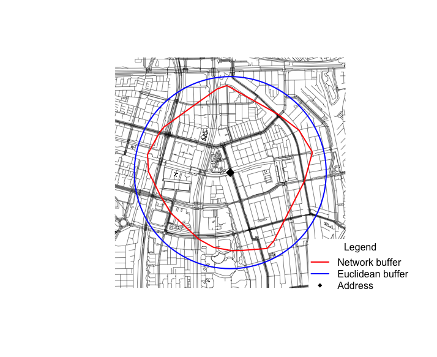
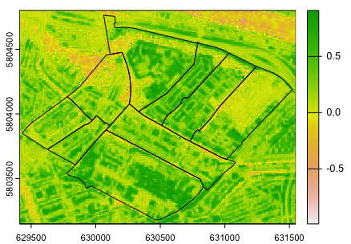
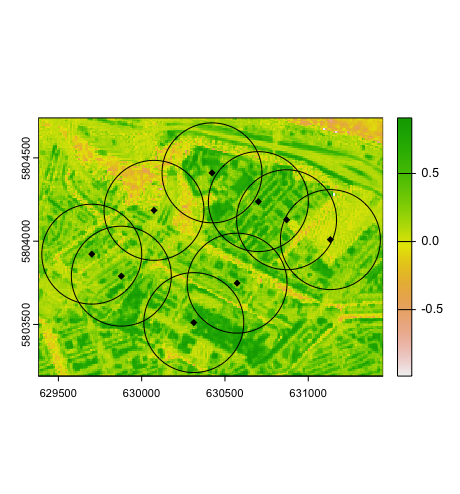
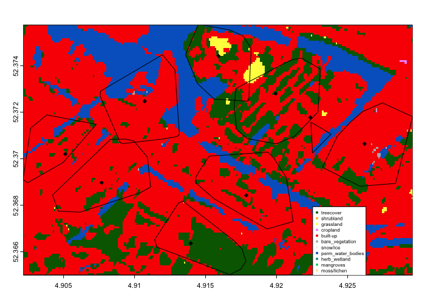
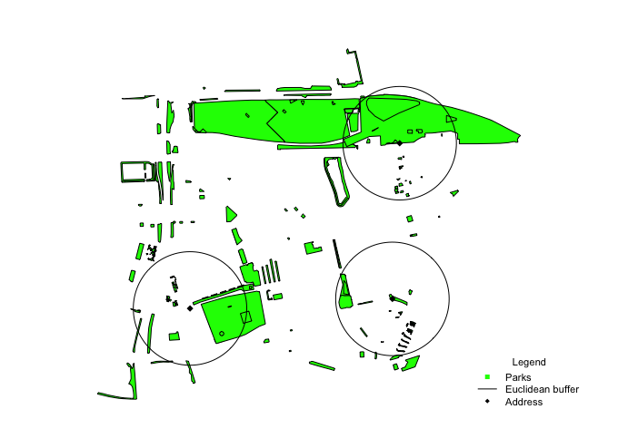
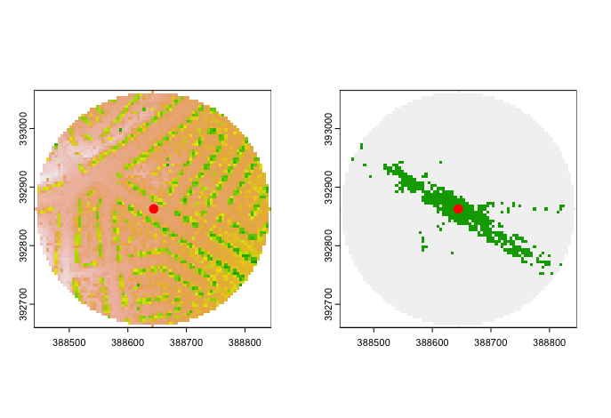

# Green Exposure

<!-- badges: start -->
<!-- badges: end -->
- [Installation](#installation)
- [Data](#data)
  * [Ams_Neighborhoods](#ams_neighborhoods)
  * [Ams_Houses](#ams_houses)
  * [Ams_Parks](#ams_parks)
- [Functionalities](#functionalities)
  * [Preparation](#preparation)
  * [Availability](#availability)
    + [Calc NDVI](#calc-ndvi)
    + [Land Cover](#land-cover)
    + [Canopy coverage](#canopy-coverage)
    + [Park percentage](#park-percentage)
  * [Accessibility](#accessibility)
    + [Park access](#park-access)
  * [Visibility](#visibility)
    + [Viewshed](#viewshed)
    + [VGVI](#vgvi)
    + [Streetview](#streetview)
- [Alternative Installation](#alternative-installation)
  * [GEE](#gee)
  * [Rcpp](#rcpp)


# Installation

You can install the development version of GreenExp from [GitHub](https://github.com/) with:

``` r
# install.packages("devtools")
devtools::install_github("Spatial-Data-Science-and-GEO-AI-Lab/GreenEx_R")
```


---

# Data 

This package is provided with three sf datasets:

1. [Ams_Neighborhoods](#ams_neighborhoods)
2. [Ams_Houses](#ams_houses)
3. [Ams_Parks](#ams_parks)

These datasets will be used as example to explain the [Functionalities](#functionalities).

#### Ams_Neighborhoods

The first dataset is an sf data frame of neighborhoods in Amsterdam. This dataset is retrieved from [Gemeente Amsterdam](https://maps.amsterdam.nl/gebiedsindeling/). 

Run the following code for more information 

```{r}
library(GreenExp) # If GreenExp is not loaded yet
?Ams_Neighborhoods
```


---

#### Ams_Houses

The Ams_Houses contain houses that are created by taking the centroid of the aforementioned [Ams_Neighborhoods](#Ams_Neighborhoods)
Run the following code for more information 
```{r}
library(GreenExp) # If GreenExp is not loaded yet
?Ams_Houses
```

---

#### Ams_Parks

The Ams_Parks dataset is also retrieved from the [Gemeente Amsterdam](https://maps.amsterdam.nl/stadsparken/)
Run the following code for more information 

```{r}
library(GreenExp) # If GreenExp is not loaded yet
?Ams_Parks
```

---


# Functionalities 

---

## Preparation

The Functionalities, which will be treated in the next subsections, will be provided with examples.
To avoid computationally heavy examples, a few neighborhoods in Amsterdam will be selected, namely: 
Rapenburg, Uilenburg, Valkenburg, Marine-Etablissement, Kadijken, Plantage, Kattenburg, Wittenburg and Oostenburg. 

The code below makes this dataset and showcases in the plot which neighborhoods are selected.

```{r, warning=FALSE}
library(GreenExp) # If not loaded yet
library(magrittr) # If not loaded yet (used for piping %>%)


neighborhoods <- c('Rapenburg', 'Uilenburg', 'Valkenburg', 
            'Marine-Etablissement', 'Kadijken', 'Plantage', 
            'Kattenburg', 'Wittenburg', 'Oostenburg')

# Filter the neighborhoods
df <- Ams_Neighborhoods %>%
  dplyr::filter(Buurt %in% neighborhoods)

# Create point locations in Amsterdam  
df_points <- sf::st_centroid(df)

# Create the parks
df_parks <- Ams_Parks

map <- mapview::mapview(list(df, df_points), label = c("Buurt", "Buurtcode"),
                        alpha.regions=c(0,1),  legend=F, lwd=1)

# Display the updated map
map
```


---

## Availability

Availability will be assessed using four functions:

1. [Calc NDVI](#calc-ndvi)
2. [Land Cover](#land-cover)
3. [Canopy coverage](#canopy-coverage)
4. [Park percentage](#park-percentage) 

Each of these functions will provide an [sf](https://r-spatial.github.io/sf/articles/sf1.html) `dataframe` that includes the input location and the specific values requested within a defined buffer.


The user has the option to input either a point geometry or a (multi)polygon geometry. By default, the address location will be transformed into a point geometry, and a buffer will be created around it to calculate the availability. However, users can choose to use the provided polygon geometry to calculate availability by setting the 'address_location_neighborhood' parameter to TRUE.

By default, the buffer around the input location is measured in Euclidean distance. However, it can be modified to utilize a network buffer. The distinction between the two types of buffers is illustrated in the figure below. The Euclidean buffer in this instance has a fixed radius of 1000 meters, while the network buffer is calculated based on a speed of 5 km/h over a duration of 10 minutes.




In the following subsections, a brief description of each availability function will be provided, along with examples extracted from the neighborhood polygons and points in Amsterdam. 

---

### Calc NDVI 

The `calc_ndvi` function computes the average Normalized Difference Vegetation Index [(NDVI)](https://en.wikipedia.org/wiki/Normalized_difference_vegetation_index) within a specified distance for given location(s). The input for the function is `address_location` which should be an `sf dataframe`. It is recommended to provide the `address location` with a projected Coordinate Reference System [(CRS)](https://docs.qgis.org/3.28/en/docs/gentle_gis_introduction/coordinate_reference_systems.html#:~:text=In%20layman%27s%20term%2C%20map%20projections,real%20places%20on%20the%20earth). If no projected CRS is provided, the address location will be automatically projected to [WGS 84 / World Mercator](https://epsg.io/3395). 


You have the option to provide a raster file containing NDVI values. However, if no raster file is provided, the function will use the [Sentinel-2-l2a](https://planetarycomputer.microsoft.com/dataset/sentinel-2-l2a) dataset from Planetary Computer as the default data source for calculating NDVI. The figures below illustrate two examples of NDVI in Amsterdam. The first plot showcases the aforementioned neighborhoods in Amsterdam and there NDVI, the second one shows the address points within an euclidean buffer of 300 meters 

Neighborhood NDVI        |  Addresses within euclidean distance NDVI
:-------------------------:|:-------------------------:
   |  

If desired, users are able to switch the engine to `GEE` (Google Earth Engine) for performing the calculations


---

Below you can find the code where the results correspond with the NDVI figure. 

```{r}
GreenExp::calc_ndvi(df, address_location_neighborhood = TRUE, UID=df$Buurt)
```


---

### Land Cover


The `land_cover` function calculates the average land cover within a specified distance for given location(s). The input for the function is address_location, which should be an `sf dataframe` with projected Coordinate Reference System (CRS) information. If no CRS is provided, the function will automatically project the address location to WGS 84 / World Mercator.

You have the option to provide a raster file wiht land cover values. When this is not provided, the [esa-worldcover](https://planetarycomputer.microsoft.com/dataset/esa-worldcover) data set of Planetary Computer will be used to calculate the land cover.

In the code chunk and figure below an example is given for the Amsterdam area. It illustrates an example of land cover within a network buffer of 500 meters in Amsterdam. It showcases three address locations, and the land cover is determined based on the surrounding road network obtained from the  [osmextract](https://cran.r-project.org/web/packages/osmextract/vignettes/osmextract.html) package.


 

---
```{r}
GreenExp::land_cover(df_points, buffer_distance=500, network_buffer=T)
```


---

### Canopy coverage

The `canopy_perc` function calculates the percentage of a canopy within a given buffer distance or location. 

``` r
# Read the canopy dataset
canopy <- sf::st_read("Data/CanopyTestArea.gpkg")

canopy_perc(address_location = address_test, canopy_layer = canopy, buffer_distance = 500)
 

# Simple feature collection with 3 features and 2 fields
# Geometry type: POINT
# Dimension:     XY
# Bounding box:  xmin: 385981.9 ymin: 392861.6 xmax: 388644.2 ymax: 395322.2
# Projected CRS: OSGB36 / British National Grid
#   UID canopy_pct                  geometry
# 1   1   14.42063 POINT (388644.2 392861.6)
# 2   2   19.27852 POINT (385981.9 393805.5)
# 3   3   10.67145 POINT (388631.2 395322.2)
```

---

### Park percentage

The `park_pct` function gives the percentage of park coverage given a certain buffer. If the `park_layer` is not given, the parks will be retrieved using features from [osmdata](https://wiki.openstreetmap.org/wiki/Map_features). 



``` r
park_pct(address_3, buffer_distance=400)
# Euclidean distance will be used to calculate the buffers around the address location that is given
# Simple feature collection with 3 features and 2 fields
# Geometry type: POINT
# Dimension:     XY
# Bounding box:  xmin: 118231.8 ymin: 487636.8 xmax: 119718.2 ymax: 488790.5
# Projected CRS: Amersfoort / RD New
#   UID  park_pct                  geometry
# 1   1 23.743997 POINT (118231.8 487636.8)
# 2   2 51.433460 POINT (119718.2 488790.5)
# 3   3  4.827692 POINT (119659.3 487693.7)

```

---

## Accessibility

### Park access

In the `parks_access` functions, the nearest parks for the given address locations will be created and whether these parks are within a given buffer distance. To calculate the distance to the parks, fake entry points are created. These fake entrances are created by making a buffer of 20 meter around the park polygon. this buffer is intersected with the intersection nodes which is created by intersecting the network points created with the parks. 


``` r
parks_access(address_location, buffer_distance=350)
# You did not provide a network file, a network will be created using osm.
# If a city is missing, it will take more time to run the function
# The input place was matched with Greater Manchester. 
#   |===============================================================================| 100%
# File downloaded!
# Start with the vectortranslate operations on the input file!
# 0...10...20...30...40...50...60...70...80...90...100 - done.
# Finished the vectortranslate operations on the input file!
# Simple feature collection with 3 features and 3 fields
# Geometry type: POINT
# Dimension:     XY
# Bounding box:  xmin: 385981.9 ymin: 392861.6 xmax: 388644.2 ymax: 395322.2
# Projected CRS: OSGB36 / British National Grid
#   UID closest_park parks_in_buffer                  geometry
# 1   1     264.6468            TRUE POINT (388644.2 392861.6)
# 2   2     167.2045            TRUE POINT (385981.9 393805.5)
# 3   3     278.6349            TRUE POINT (388631.2 395322.2)
```


---

## Visibility
 
The visibility functions are made by the [GVI](https://github.com/STBrinkmann/GVI) package with some adaptations. 

---

### Viewshed

The viewshed function computes a binary viewshed of a single point on a Digital Surface Model (DSM) raster. A radial buffer is applied on the observer position, and visibility is being calculated usig a C++ implementation of Bresenham’s line algorithm [Bresenham 1965](https://ieeexplore.ieee.org/document/5388473) & [Bresenham 1977](https://doi.org/10.1145/359423.359432) and simple geometry. The
result of the `viewshed` function is a radial raster where 0 =
no-visible and 1 = visible area.

For a better explanation, go to the [GVI](https://github.com/STBrinkmann/GVI) package.

**EXAMPLE**

Data can be retrieved from this [site](https://zenodo.org/record/5061257). 

```r
# Read in the digital eleveation model
DEM <- terra::rast('data/GreaterManchester_DTM_5m.tif')
# Read the digital surfaca model
DSM <- terra::rast('data/GreaterManchester_DSM_5m.tif')
# Read the greenspace 
GS <- terra::rast('data/GreaterManchester_GreenSpace_5m.tif')

# 
observer <- sf::st_sf(sfheaders::sf_point(c(388644.2, 392862.7)), crs = sf::st_crs(terra::crs(DEM)))

vs <- GreenExp::viewshed(observer = observer, dsm_rast = DSM, dtm_rast = DEM,
                         max_distance = 200, observer_height = 1.7, plot = TRUE)
```




The left plot represents the Digital Elevation Model (DEM), whereas the right plot represents the viewshed, where green is the visibile area and gray is not visible. 

### VGVI

The Viewshed Greenness Visibility Index (VGVI) represents the proportion of visible greenness to the total visible area based on the `viewshed`. The estimated VGVI values range between 0 and 1, where = no green cells and 1= all of the visible cells are green.

Based on a viewshed and a binary greenspace raster, all visible points are classified as visible green and visible no-green. All values are summarized using a decay function, to account for the reducing visual prominence of an object in space with increasing distance from the observer. Currently two options are supported, a logistic and an exponential function.

For more information about the VGVI please go to the [GVI](https://github.com/STBrinkmann/GVI) package. For more information about the algorithms look at the paper by [Brinkmann, 2022](https://doi.org/10.5194/agile-giss-3-27-2022)

```r
VGVI <- vgvi_from_sf(observer = observer,
             dsm_rast = DSM, dtm_rast = DEM, greenspace_rast = GS,
             max_distance = 200, observer_height = 1.7,
             m = 0.5, b = 8, mode = "logit")
# Simple feature collection with 1 feature and 2 fields
# Geometry type: POINT
# Dimension:     XY
# Bounding box:  xmin: 388644.2 ymin: 392862.7 xmax: 388644.2 ymax: 392862.7
# Projected CRS: OSGB36 / British National Grid
#   id      VGVI                  geometry
# 1  1 0.3177667 POINT (388644.2 392862.7)
```

--- 

### streetview 

---

# Alternative installation

To make optimal use of the package 

## GEE 

This step is optional, by default the [Planetary Computer](https://planetarycomputer.microsoft.com) will be used for satellite images, 
But if you also want to use the [Google Earth Engine](https://earthengine.google.com), and do not have it installed yet,
you need to follow the following steps or the steps given in this [instruction video](https://www.youtube.com/watch?v=_fDhRL_LBdQ)

**Step 1:**

Make an account on  [Google Earth Engine](https://earthengine.google.com)


``` r
install.packages(c("sf", "reticulate", "remotes"))
```
afterwards install the [rgee](https://github.com/r-spatial/rgee) package from github

``` r
# Install the rgee package from the r spatial GitHub
remotes::install_github("r-spatial/rgee")

# load the reticulate and rgee package
library(reticulate)
library(rgee)
```

**Step 2:**

Running `reticulate::py_discover_config()` will install `Miniconda`

``` r
# Use the py_discover_config() function to see what version of Python will be used
# without actually loading pythong
reticulate::py_discover_config()

# python:         /Users/martijn/.virtualenvs/rgee/bin/python
# libpython:      /Users/martijn/anaconda3/lib/libpython3.10.dylib
# pythonhome:     /Users/martijn/.virtualenvs/rgee:/Users/martijn/.virtualenvs/rgee
# version:        3.10.9 (main, Mar  1 2023, 12:20:14) [Clang 14.0.6 ]
# numpy:          /Users/martijn/.virtualenvs/rgee/lib/python3.10/site-packages/numpy
# numpy_version:  1.24.3

# Verify the current Python path
import('sys')$executable
# [1] "/Users/martijn/.virtualenvs/rgee/bin/python"


# Create an isolated Python venv with all rgee dependencies
ee_install()
# look at the path to the rgee env
```

**Step 3:**

After this bit, please restart your pc/laptop and launch R again. 

**Step 4:**

Initializing

``` r
# Set python version to use
reticulate::use_python("/Users/martijn/.virtualenvs/rgee/bin/python")
reticulate::py_config()

library(rgee)

#Initialize the Earth Engine
ee_Initialize()

## 2. Install geemap in the same Python ENV that use rgee
py_install("geemap")
gm <- import("geemap")

```

Enter the email you used to sign-up for GEE 

copy the code into R 

── rgee 1.1.6.9999 ───────────────────────────────────── earthengine-api 0.1.354 ── 

 ✔ user: not_defined 
 
 ✔ Initializing Google Earth Engine:  DONE!
 
 ✔ Earth Engine account: users/ee-greenexp 
 
---

## Rcpp 

Make sure the [Rcpp package](https://cran.r-project.org/web/packages/Rcpp/index.html) is installed.
If you are using mac, make sure you have [Xcode](https://apps.apple.com/nl/app/xcode/id497799835?mt=12) installed. 

Furthermore you have to make a Makevars file if the cpp files are not working. 
go to terminal and do the following:

```
mkdir .R
cd .R 
touch Makevars
open Makevars

## copy and paste:
FC = /opt/homebrew/Cellar/gcc/13.1.0/bin/gfortran
F77 = /opt/homebrew/Cellar/gcc/13.1.0/bin/gfortran
FLIBS = -L/opt/homebrew/Cellar/gcc/13.1.0/lib/gcc/13
```
---

## Mapillary

To use the [streetview](#streetview) function, data will be retrieved using the [mapillary](https://www.mapillary.com) API


