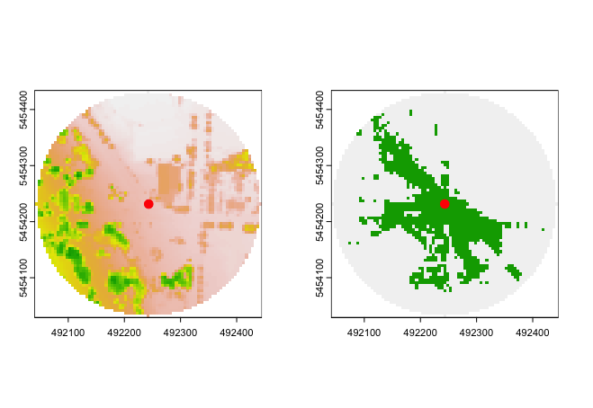

# GreenExp

<!-- badges: start -->
<!-- badges: end -->

- [Installation](#installation)
- [Functions](#functions)
  * [Availability](#availability)
    + [Calc NDVI](#calc-ndvi)
    + [Land Cover](#land-cover)
    + [Canopy coverage](#canopy-coverage)
    + [Park percentage](#park-percentage)
  * [Accessibility](#accessibility)
    + [Installation](#installation-1)
    + [Park access](#park-access)
    + [Parks access fake entrance](#parks-access-fake-entrance)
    + [Population](#population)
  * [Visibility](#visibility)
    + [Installation](#installation-2)
    + [Viewshed](#viewshed)


  

# Installation

You can install the development version of GreenExp from [GitHub](https://github.com/) with:

``` r
# install.packages("devtools")
devtools::install_github("Spatial-Data-Science-and-GEO-AI-Lab/GreenEx_R")
```

# Functions

## Availability

### Calc NDVI 

The `calc_ndvi` function returns a `sf` dataset with the address location, the buffer around the address location and the ndvi value in that buffer. Note that for this function, the speed and time are used to create a buffer. An alternative is the buffer distance which will be showcased in the next function.


``` r
library(GreenExp)
## basic example code
# Read the home address
address_test <- sf::st_read("Data/Test_multiple_home_locations.gpkg")
# Read the NDVI dataset
ndvi_test <- terra::rast("data/NDVI_data_test.tif")
# the funciton 'calc_ndvi' returns a sf dataset with the mean ndvi within a buffer from the home address 
ndvi_scores <- GreenExp::calc_ndvi(address_location = address_test, raster = ndvi_test, buffer_distance=400)
ndvi_scores
class(ndvi_scores)
## [1] "sf"         "data.frame"
```

This is a simple feature collection with 3 features and 2 fields. The details of the collection are as follows:

- Active geometry column: `geometry`
- Geometry type: `POINT`
- Dimension: `XY`
- Bounding box: `xmin: 385981.9`, `ymin: 392861.6`, `xmax: 388644.2`, `ymax: 395322.2`
- Projected CRS: `OSGB36 / British National Grid`

The feature collection includes the following features:

| UID | mean_NDVI |                  geometry                  |                       buffer                       |
|:-----:|:-----------:|:--------------------------------------------:|:--------------------------------------------------:|
| 1   | 0.3912100 | POINT (388644.2 392861.6)                  | POLYGON ((389044.2 392861.6, ...                   |
| 2   | 0.3373851 | POINT (385981.9 393805.5)                  | POLYGON ((386381.9 393805.5, ...                   |
| 3   | 0.3896356 | POINT (388631.2 395322.2)                  | POLYGON ((389031.2 395322.2, ...                   |


---

When the NDVI file is not given, the NDVI will be calculated using the [Google Earth Engine](https://earthengine.google.com). 

```r
GreenExp::calc_ndvi(address_location = address_test, buffer_distance = 400)
#[1] "Buffer distance is used for calculations"
#The image scale is set to 1000.
#Simple feature collection with 3 features and 2 fields
#Active geometry column: geometry
#Geometry type: POINT
#Dimension:     XY
#Bounding box:  xmin: 385981.9 ymin: 392861.6 xmax: 388644.2 ymax: 395322.2
#Projected CRS: OSGB36 / British National Grid
#  id      NDVI                  geometry                     geometry.1
#1  1 0.4026307 POINT (388644.2 392861.6) POLYGON ((389044.2 392861.6...
#2  2 0.4907173 POINT (385981.9 393805.5) POLYGON ((386381.9 393805.5...
#3  3 0.4494947 POINT (388631.2 395322.2) POLYGON ((389031.2 395322.2...
```


---

### Land Cover

The `land_cover` function calculates the percentage of area covered by each land cover class within a given buffer distance or location. In this instance, the speed and time are used to calculate the buffer. The codes in the table below represent land types. 

``` r
# Read the dataset with the land coverages. 
landcover_test <- terra::rast("Data/Landcover_data_test.tif")
# Use the land_cover function 
greencover_values <- GreenExp::land_cover(address_location = address_test, class_raster = landcover_test, speed=5, time=10)
greencover_values
class(greencover_values)
## [1] "sf"         "data.frame"

```

This is a simple feature collection with 3 features and 37 fields. The details of the collection are as follows:

- Active geometry column: `geometry`
- Geometry type: `POINT`
- Dimension: `XY`
- Bounding box: `xmin: 385981.9`, `ymin: 392861.6`, `xmax: 388644.2`, `ymax: 395322.2`
- Projected CRS: `OSGB36 / British National Grid`

The feature collection includes the following fields:

| UID | 1001 | 1002 | 1003 | 1004 | 1005 | 1101 | 1102 | 1103 | 1104 | 1105 | 1201 | 1202 | 1203 | 1204 | 1205 | 1301 | 1302 | 1303 | 1304 | 1305 | 1401 | 1402 | 1403 | 1404 | 1405 | 1501 | 1502 | 1503 | 1504 | 1505 | 2001 | 2002 | 2003 | 2004 | 2005 | NA | geometry| buffer |
|-----|------|------|------|------|------|------|------|------|------|------|------|------|------|------|------|------|------|------|------|------|------|------|------|------|------|------|------|------|------|------|------|------|------|------|------|------|-------------------------------------|-------------------------------------------|
| 1   | 0.26 | 0    | 0.03 | 0.02 | 0.05 | 0.01 | 0    | 0.04 | 0.07 | 0.06 | 0.02 | 0    | 0.01 | 0.02 | 0.03 | 0.15 | 0    | 0.06 | 0.05 | 0.09 | 0.01 | 0    | 0.01 | 0.01 | 0.01 | 0.01    | 0    | 0    | 0    | 0    | 0    | 0    | 0    | 0    | 0    | 0.00 | POINT (388644.2 392861.6) | POLYGON ((388727 391348, ...
| 2   | 0.24 | 0    | 0.03 | 0.01 | 0.05 | 0.02 | 0    | 0.04 | 0.05 | 0.06 | 0.01 | 0    | 0    | 0.01 | 0.03 | 0.16 | 0    | 0.06 | 0.05 | 0.10 | 0.02 | 0    | 0.01 | 0.01 | 0.02 | 0    | 0    | 0    | 0    | 0    | 0    | 0    | 0    | 0| 0    | 0.01 | POINT (385981.9 393805.5) | POLYGON ((385566 391671, ...
| 3   | 0.27 | 0    | 0.02 | 0.02 | 0.04 | 0.01 | 0    | 0.05 | 0.07 | 0.07 | 0.01 | 0    | 0.01 | 0.03 | 0.03 | 0.16 | 0    | 0.04 | 0.05 | 0.06 | 0.01 | 0    | 0    | 0.01 | 0    | 0    | 0    | 0    | 0    | 0    | 0    | 0    | 0    | 0    | 0    | 0.00 |POINT (388631.2 395322.2) | POLYGON ((388523 392904, ...

---

### Canopy coverage

The `canopy_perc` function calculates the percentage of a canopy within a given buffer distance or location. 

``` r
# Read the canopy dataset
canopy <- sf::st_read("Data/CanopyTestArea.gpkg")

canopy_values <- canopy_perc(address_location = address_test, canopy_layer = canopy, buffer_distance = 500)
canopy_values 
class(canopy_values)
#[1] "sf"         "data.frame"
```

- Simple feature collection with 3 features and 2 fields
- Active geometry column: geometry
- Geometry type: POINT
- Dimension:     XY
- Bounding box:  xmin: 385981.9 ymin: 392861.6 xmax: 388644.2 ymax: 395322.2
- Projected CRS: OSGB36 / British National Grid

| UID | canopy_pct |                  geometry                  |                       buffer                       |
|:-----:|------------:|:--------------------------------------------:|:--------------------------------------------------:|
| 1   | 14.42063   | POINT (388644.2 392861.6)                  | POLYGON ((389144.2 392861.6, ...                   |
| 2   | 19.27852   | POINT (385981.9 393805.5)                  | POLYGON ((386481.9 393805.5, ...                   |
| 3   | 10.67145   | POINT (388631.2 395322.2)                  | POLYGON ((389131.2 395322.2, ...                   |

---

### Park percentage

The `park_pct` function gives the percentage of park coverage given a certain buffer. If the `park_layer` is not given, the parks will be retrieved using `osmdata`. 

``` r
# use the park_pct function with only address_location and buffer distance
park_pct_values <- park_pct(address_location = address_test, buffer_distance = 300)
park_pct_values
class(park_pct_values)
#[1] "sf"         "data.frame"
```

So the park percentage in a buffer of 300 meters is:

- Simple feature collection with 3 features and 2 fields
- Active geometry column: geometry
- Geometry type: POINT
- Dimension:     XY
- Bounding box:  xmin: 385981.9 ymin: 392861.6 xmax: 388644.2 ymax: 395322.2
- Projected CRS: OSGB36 / British National Grid

| UID | park_pct   |                  geometry                  |
|:-----:|:------------:|:--------------------------------------------:|
| 1   | 3.6795963  | POINT (388644.2 392861.6)                  |
| 2   | 10.9080537 | POINT (385981.9 393805.5)                  |
| 3   | 0.1408044  | POINT (388631.2 395322.2)                  |

---

## Accessibility


### Installation 

**Step 1:**

To use the [Google Earth Engine](https://earthengine.google.com) you need to follow the following steps or the steps given in this [intruction movie](https://www.youtube.com/watch?v=_fDhRL_LBdQ)

make an account on  [Google Earth Engine](https://earthengine.google.com)


``` r
install.packages(c("sf", "reticulate", "remotes"))
```
afterwards install the [rgee](https://github.com/r-spatial/rgee) package from github

``` r
# Install the rgee package from the r spatial GitHub
remotes::install_github("r-spatial/rgee")

# load the reticulate and rgee package
library(reticulate)
library(rgee)
```

**Step 2:**

Running `reticulate::py_discover_config()` will install `Miniconda`

``` r
# Use the py_discover_config() function to see what version of Python will be used
# without actually loading pythong
reticulate::py_discover_config()

# python:         /Users/martijn/.virtualenvs/rgee/bin/python
# libpython:      /Users/martijn/anaconda3/lib/libpython3.10.dylib
# pythonhome:     /Users/martijn/.virtualenvs/rgee:/Users/martijn/.virtualenvs/rgee
# version:        3.10.9 (main, Mar  1 2023, 12:20:14) [Clang 14.0.6 ]
# numpy:          /Users/martijn/.virtualenvs/rgee/lib/python3.10/site-packages/numpy
# numpy_version:  1.24.3

# Verify the current Python path
import('sys')$executable
# [1] "/Users/martijn/.virtualenvs/rgee/bin/python"


# Create an isolated Python venv with all rgee dependencies
ee_install()
# look at the path to the rgee env
```

**Step 3:**

After this bit, please restart your pc/laptop and launch R again. 

**Step 4:**

Initializing

``` r
# Set python version to use
reticulate::use_python("/Users/martijn/.virtualenvs/rgee/bin/python")
reticulate::py_config()

library(rgee)

#Initialize the Earth Engine
ee_Initialize()

## 2. Install geemap in the same Python ENV that use rgee
py_install("geemap")
gm <- import("geemap")

```

Enter the email you used to sign-up for GEE 

copy the code into R 

── rgee 1.1.6.9999 ───────────────────────────────────── earthengine-api 0.1.354 ── 

 ✔ user: not_defined 
 
 ✔ Initializing Google Earth Engine:  DONE!
 
 ✔ Earth Engine account: users/ee-greenexp 
 
---

### Park access

The first accessibility function returns the closest park from a certain point. 
In the `parks_access` function the centroids of the parks will be used to calculate the distance. The parks can be give as a layer, when the parks file is missing [osmdata](https://www.openstreetmap.org) will be used to retrieve the parks. 


``` r

parks_distance <- parks_access(address = address_test, buffer_distance = 400)
parks_distance
class(parks_distance)
#[1] "sf"         "data.frame"
```

- Simple feature collection with 3 features and 2 fields
- Active geometry column: geometry
- Geometry type: POINT
- Dimension:     XY
- Bounding box:  xmin: 385981.9 ymin: 392861.6 xmax: 388644.2 ymax: 395322.2
- Projected CRS: OSGB36 / British National Grid

| UID | closest_park | parks_in_buffer |                  geometry                  |
|:-----:|:--------------:|:-----------------:|:--------------------------------------------:|
| 1   | 264.9838     | TRUE            | POINT (388644.2 392861.6)                  |
| 2   | 334.9009     | TRUE            | POINT (385981.9 393805.5)                  |
| 3   | 302.8359     | TRUE            | POINT (388631.2 395322.2)                  |


---


### Parks access fake entrance

In the next accessibility function, instead of the centroids, fake entrances will be used to calculate the distance to. These fake entrances are created by making a buffer of 20 meter around the park polygon. this buffer is intersected with the intersection nodes which is created by intersecting the network points created with the `OnlineStreetMap` data and the `parks` data. 


``` r
parks_distance_fake_entrance <- parks_access_entrance(address = address_test, buffer_distance = 400)
parks_distance_fake_entrance
class(parks_distance_fake_entrance)
#[1] "sf"         "data.frame"
```

- Simple feature collection with 3 features and 2 fields
- Active geometry column: geometry
- Geometry type: POINT
- Dimension:     XY
- Bounding box:  xmin: 385981.9 ymin: 392861.6 xmax: 388644.2 ymax: 395322.2
- Projected CRS: OSGB36 / British National Grid

| UID | closest_park | parks_in_buffer |      geometry      |
|:---:|:------------:|:--------------:|:------------------:|
|  1  |   264.9838   |      TRUE      |  POINT (388644.2 392861.6)  |
|  2  |    129.0000  |      TRUE      |  POINT (385981.9 393805.5)  |
|  3  |   279.2987   |      TRUE      |  POINT (388631.2 395322.2)  |

---

### Population 

This function is in progress. I am trying to get the [Google Earth Engine](https://earthengine.google.com) in the package to retrieve the world population.
This will be used to make a cost analysis for people to go to a park. 


---

## Visibility
 
The visibility functions are made by the [GVI](https://github.com/STBrinkmann/GVI) package with some adaptations. 

---

### Installation 

Make sure the [Rcpp package](https://cran.r-project.org/web/packages/Rcpp/index.html) is installed.
If you are using mac, make sure you have [Xcode](https://apps.apple.com/nl/app/xcode/id497799835?mt=12) installed. 

Furthermore you have to make a Makevars file if the cpp files are not working. 
go to terminal and do the following:

```
mkdir .R
cd .R 
touch Makevars
open Makevars

## copy and paste:
FC = /opt/homebrew/Cellar/gcc/13.1.0/bin/gfortran
F77 = /opt/homebrew/Cellar/gcc/13.1.0/bin/gfortran
FLIBS = -L/opt/homebrew/Cellar/gcc/13.1.0/lib/gcc/13
```
---

### Viewshed

The viewshed function computes a binary viewshed of a single point on a Digital Surface Model (DSM) raster. A radial buffer is applied on the observer position, and visibility is being calculated usig a C++ implementation of Bresenham’s line algorithm [Bresenham 1965](https://ieeexplore.ieee.org/document/5388473) & [Bresenham 1977](https://doi.org/10.1145/359423.359432) and simple geometry. The
result of the `viewshed` function is a radial raster where 0 =
no-visible and 1 = visible area.

For a better explanation, go to the [GVI](https://github.com/STBrinkmann/GVI) package.

**EXAMPLE**

The data is also used from the GitHub of [Brinkmann](https://github.com/STBrinkmann)

```r
# Download DEM
DEM_tmp <- tempfile(fileext = ".tif")
download.file(url = "https://github.com/STBrinkmann/data/raw/main/GVI_Data/GVI_DEM.tif",
              destfile = DEM_tmp, mode="wb")

# Download DSM
DSM_tmp <- tempfile(fileext = ".tif")
download.file(url = "https://github.com/STBrinkmann/data/raw/main/GVI_Data/GVI_DSM.tif",
              destfile = DSM_tmp, mode="wb")

# Download GreenSpace
GS_tmp <- tempfile(fileext = ".tif")
download.file(url = "https://github.com/STBrinkmann/data/raw/main/GVI_Data/GVI_GreenSpace.tif",
              destfile = GS_tmp, mode="wb")
```

```r

DEM <- terra::rast(DEM_tmp)
DSM <- terra::rast(DSM_tmp)
GreenSpace <- terra::rast(GS_tmp)


observer <- sf::st_sf(sfheaders::sf_point(c(492243.3, 5454231.4)), crs = sf::st_crs(26910))
```

```r
vs <- GreenExp::viewshed(observer = observer, dsm_rast = DSM, dtm_rast = DEM,
               max_distance = 200, observer_height = 1.7, plot = TRUE)
```



The left plot represents the Digital Elevation Model (DEM), whereas the right plot represents the viewshed, where green is the visibile area and gray is not visible. 

### VGVI

The Viewshed Greenness Visibility Index (VGVI) represents the proportion of visibile greeness to the total visible area based on the `viewshed`. The estimated VGVI values range between 0 and 1, where = no green cells and 1= all of the visible cells are green.

Based on a viewshed and a binary greenspace raster, all visible points are classified as visible green and visible no-green. All values are summarized using a decay function, to account for the reducing visual prominence of an object in space with increasing distance from the observer. Currently two options are supported, a logistic and an exponential function.

For more information about the VGVI please go to the [GVI](https://github.com/STBrinkmann/GVI) package. For more information about the algorithms look at the paper by [Brinkmann, 2022](https://doi.org/10.5194/agile-giss-3-27-2022)

```r
VGVI <- vgvi_from_sf(observer = observer,
             dsm_rast = DSM, dtm_rast = DEM, greenspace_rast = GreenSpace,
             max_distance = 200, observer_height = 1.7,
             m = 0.5, b = 8, mode = "logit")
```

Simple feature collection with 1 feature and 2 fields
Geometry type: POINT
Dimension:     XY
Bounding box:  xmin: 492243.3 ymin: 5454231 xmax: 492243.3 ymax: 5454231
Projected CRS: NAD83 / UTM zone 10N
  id      VGVI                 geometry
1  1 0.5255536 POINT (492243.3 5454231)


