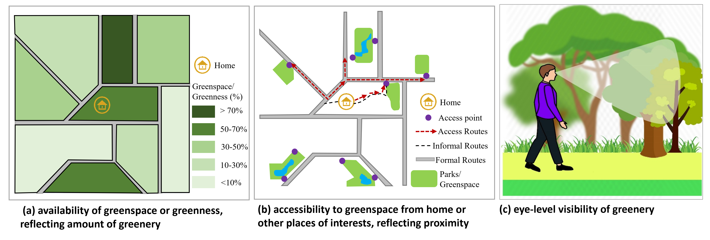
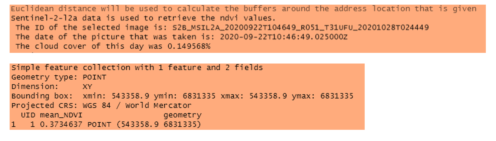
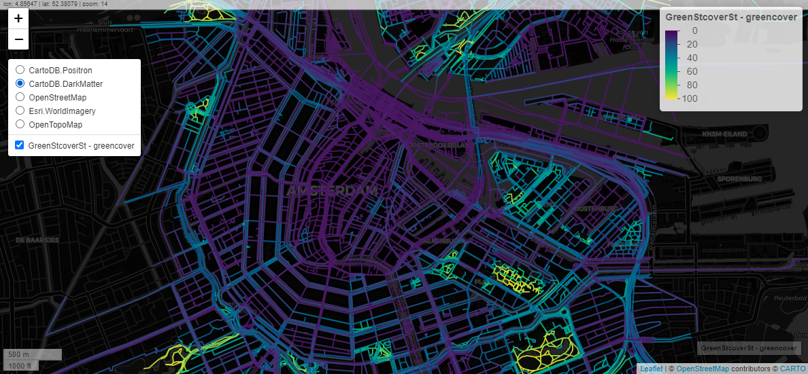
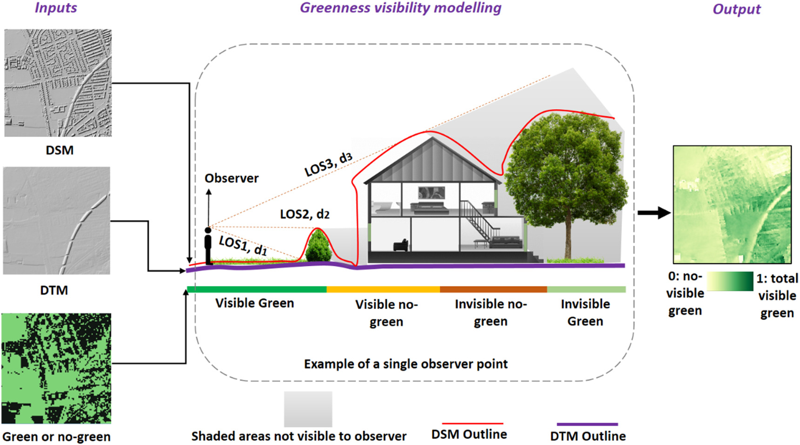
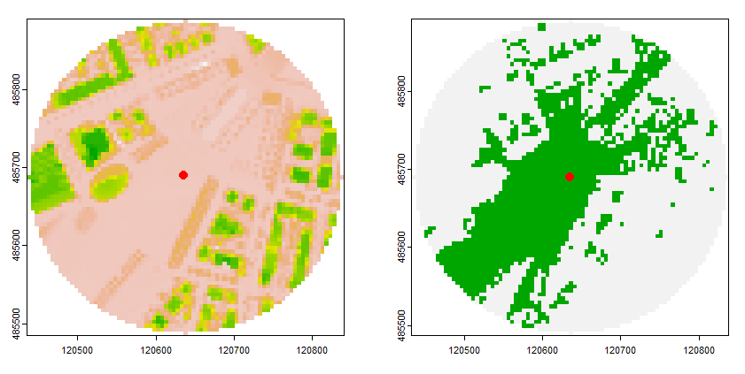

# Greenness Exposure Assessment in R 

[](https://zenodo.org/badge/latestdoi/634929610)


# Aim and objectives

This package is developed to facilitate robust and transparent analysis in greenspace and vegetation in general. It provides researchers with a collection of multidimensional functionalists of greenness modeling that can be applied across multiple cities, rural areas, countries, enabling comprehensive spatial analysis and enhancing the accuracy of results.

# Table of contents

<!-- badges: start -->
<!-- badges: end -->
- [Installation](#installation)
- [Functionalities](#functionalities)
  * [Availability](#availability)
    + [Calc NDVI](#calc-ndvi)
    + [Land Cover](#land-cover)
    + [Canopy coverage](#canopy-coverage)
    + [Greenspace percentage](#greenspace-percentage)
    + [Green Cover Streets](#green-cover-streets)
  * [Accessibility](#accessibility)
    + [Greenspace access](#greenspace-access)
  * [Visibility](#visibility)
    + [Viewshed](#viewshed)
    + [vgvi from sf](#vgvi-from-sf)
    + [vgvi from address](#vgvi-from-address)
- [Performance-errors-limitation-notes](#performance-errors-limitation-notes)
- [Extended Installation](#extended-installation)
  * [GEE](#gee)
  * [Rcpp](#rcpp)
- [Sources](#sources)
- [Acknowledgements](#acknowledgements-and-contact)

# Installation

You can install the development version of GreenExp from [GitHub](https://github.com/) with:
For Windows installation, please install R-tools from (https://cran.r-project.org/bin/windows/Rtools/) before running the code below

``` r
# install.packages("devtools") # do it once
devtools::install_github("Spatial-Data-Science-and-GEO-AI-Lab/GreenExp_R", dependencies = TRUE)

```
To use in MAC see the extended installation instruction.

---


# Functionalities 
The idea of GreenExp package is to provide with multiple approaches in measure greenness in diverse locations building mostly on Openly available global data set and software tools and platforms. It provides functions to measure how much greenery is available, accessible, and visible at varying locations, from residential address, to streets. From urban areas to rural regions. It was wider connections with OpenStreetMap, Microsoft Planetary Computer Database and you can also use your own files to define home address, neighborhoods or even streets using local files. The package provides three broad spatial measures of greenness exposure as illustrated in the figure below based on the definition from 
[Labib et al., 2020](https://research.manchester.ac.uk/en/publications/spatial-dimensions-of-the-influence-of-urban-green-blue-spaces-on)



---

The Functionalists, which will be treated in the next subsections, will be provided with examples.For reproducibility  and easier implementation we are providing example for a case city, Amsterdam. 

First load the libraries

```r
#Load libraries
library(GreenExp) # If not loaded yet
library(magrittr) # If not loaded yet (used for piping %>%)
library (sf) #Need for most spatial operation
library (sfheaders) #for additional functions to work with sf package
library(tmaptools) #do some geo-coding for OSM

```
Please note that the examples based on this data serves as an illustration, and you may need to adapt the parameters and function usage to match your specific scenario.


---

## Availability

Availability of greenness (reflecting the presence and amount of vegetation) will be assessed using four functions:

1. [Calc NDVI](#calc-ndvi)
2. [Land Cover](#land-cover)
3. [Canopy coverage](#canopy-coverage)
4. [Park percentage](#park-percentage) 
5. [Green Cover Streets](#green_cover_streets)

Each function provide opportunity to measure greenness presence and amount in varying ways. 

The user has the option to input, location name, point geometry or a (multi)polygon geometry to defined their area of analysis. 
The following subsections will briefly describe each availability function and examples extracted from the neighborhood polygons and points in Amsterdam. 

---


### Calc NDVI 
**[Global Coverage]** <br />
While street greenery is only one way of representing greenery in a place, GreenExp provide advance function to use Satellite image to estimate amount of vegetation using Normalized Difference Vegetation Index (NDVI). This data is Globally available, and can be used in urban and rural places to find presence and amount of greenness within a given area of analysis. 
The `calc_ndvi` function computes the average NDVI [(NDVI)](https://en.wikipedia.org/wiki/Normalized_difference_vegetation_index) within a specified buffer distance for a given location(s). The input for the function is `address_location`, which should be an `sf dataframe`. It is recommended to provide the `address location` with a projected Coordinate Reference System [(CRS)](https://docs.qgis.org/3.28/en/docs/gentle_gis_introduction/coordinate_reference_systems.html#:~:text=In%20layman%27s%20term%2C%20map%20projections,real%20places%20on%20the%20earth). If no projected CRS is provided, the address location will be automatically projected to [WGS 84 / World Mercator](https://epsg.io/3395). 

We have the option to provide a local raster file (from your own computer) containing NDVI values, but the projection for given raster needs to be consistent with given address files (e.g., points or polygons representing a location or an area). However, if no raster file is provided, the function will use the [Sentinel-2-l2a](https://planetarycomputer.microsoft.com/dataset/sentinel-2-l2a) data set from Planetary Computer as the default data source for calculating NDVI. The code snippet below shows how to calculate the NDVI for the neighborhoods.
Here is an example for a single in Amsterdam


``` r
#you can test your home address! For now let us go with an example
#Example Address point: Van Gogh Museum, Amsterdam 
addresspoint <- sf::st_sf(sfheaders::sf_point(c(4.881076, 52.358416)), crs = st_crs(4326))

#single address NDVI, no local NDVI file provided, Autometically extracted NDVI from Sentinel-2 Satellite images (with lowest cloud cover) found between given start and end date

#mean NDVI at single address point, here no NDVI file given so the start and end date inidicate the range within which satellite images will be search on Planetary Computer
address_ndvi <- GreenExp::calc_ndvi(addresspoint,  buffer_distance = 300, start_date = "2020-08-01", end_date = "2020-09-30")
#print the result
address_ndvi

```

In the Figure below, shows the Output while running the calc_ndvi function and printing the results. While running, the function provides enough information about what type of buffer used, which image was selected, the date and time of image captured and also the cloud cover of that image on that day. The result return a sf data object which can be saved locally as illustrated earlier. It include the 'mean_NDVI' column to present the average NDVI value around that address within 300 m Euclidean buffer. Note: the user can also select street network buffer (see the function details for more)



It should be noted, users are able to switch the engine to `GEE` (Google Earth Engine) for performing the calculations. Which need advanced installation. 

#### Multi-address location NDVI
While the previous example indicated NDVI results for a single address point. We can also calculate mean NDVI for many given address locations, here is an example for NDVI calculation at 1000 random points within Amsterdam. The user can provide their own address locations or coordinates. 

``` r
#create random points within in a city to test
# can try: "Centrum, Amsterdam" or "Washington, DC" or "Kampala, Uganda" or "Bogura, Bangladesh" and more...!
#first get the OSM city geocoded bounding box
getcityboudingbox <- tmaptools::geocode_OSM("Centrum, Amsterdam", as.sf = T,  geometry = c("bbox")) 

#generate random points within the bounding box
RandomPoints <- sf::st_sample(getcityboudingbox, size = 1000) %>% st_as_sf()

#Calculate mean NDVI at many address points
Randomaddresses_ndvi <- GreenExp::calc_ndvi(RandomPoints,  buffer_distance = 300, start_date = "2020-08-01", end_date = "2020-09-30")

#map the result using the amazing mapview 
mapview::mapview(Randomaddresses_ndvi, zcol = "mean_NDVI")

```
In the Figure illustrates the variations of mean NDVI at many different locations within the city area. 

We can test this approach in most locations around the world, given the user has an address location file either in point or polygon format. Here is an example of how to run the same function for the Neighborhood polygons for the Amsterdam city area. The package has the Neighborhood polygons attached within it for testing the approach. 

``` r
#Attch the data file
?Ams_Neighborhoods #explore the data if needed
AMS_NH <- Ams_Neighborhoods #load the file

#Calculate mean NDVI for Neighborhood polygons, here we need to metion the given address file is Neighborhood zone, so no buffer distance will be needed. 
AMS_NH_ndvi <- GreenExp::calc_ndvi(AMS_NH,  address_location_neighborhood = TRUE, start_date = "2020-08-01", end_date = "2020-09-30")

#map the result using mapview 
mapview::mapview(AMS_NH_ndvi, zcol = "mean_NDVI")

```
The following figure shows the mean NDVI values for all the Neighborhoods of Amsterdam area. 


---


### Land Cover
**[Global Coverage]** <br />
While NDVI is a widely used metric for greenness assessment but it cannot differentiate between different vegetation types, such as tree vs grass. Here we added the `land_cover` function that percentage of different land cover types (vegetation and other types of land cover/land use) within a specified distance for given location(s). The input for the function is address_location, which should be an `sf dataframe` either point or polygon with projected Coordinate Reference System (CRS) information. If no CRS/projection information is provided, the function will automatically project the address location to WGS 84 / World Mercator.

The user have the option to provide a raster file with land cover values. When this is not provided, the [esa-worldcover](https://planetarycomputer.microsoft.com/dataset/esa-worldcover) data set of Planetary Computer will be used to calculate the land cover.

In the code chunk and figure below an example is given for the Amsterdam area, where we estimated different land cover types present around each buildings within the given search area. It illustrates an example of land cover within a Euclidean buffer of 300m. It showcases more than 25k buildings, and the land cover is determined based on the given buffer zone. 

``` r
#We can use the OSM to extract building footprint data
#fist determind the bounding box to get OSM buildings within Central Amsterdam
getcityboudingbox <- tmaptools::geocode_OSM("Centrum, Amsterdam", as.sf = T,  geometry = c("bbox")) 

#download building data
buildings <- osmdata::opq(sf::st_bbox(getcityboudingbox)) %>%
  osmdata::add_osm_feature(key = "building") %>%
  osmdata::osmdata_sf()

#get the building footprint 
buildings <- buildings$osm_polygons

#estimate the land cover from ESA's land cover data
# Note: for given polygon file, this funtion autometically convert polygon to centroid point
build_land_cover <- GreenExp::land_cover (buildings,  buffer_distance = 300)

#print the result
build_land_cover

#for mapping to the building footprint we joined the land cover data to downloaded building file
#firt convert the projection to downloaded building files (as both need to be in same projection)
build_land_cover <-  sf::st_transform(build_land_cover, sf::st_crs(buildings))

#spatially join them
buildigs_landcover <- sf::st_join (buildings, build_land_cover, join= st_intersects)

#Now mapping the tree cover only, while we can explore different land cover types by clicking on each building! 
mapview::mapview(buildigs_landcover, zcol = "tree_cover")

```
The above code produce the following result, where we can visualize how much tree cover is available within 300 m of each building. The values range between 0 to 1, where 0 equals no tree cover, 1 equals 100% tree cover. 


---

### Canopy coverage
**[Limited Coverage, dependent of the availability of tree data]** <br />
While the land cover function automatically estimate tree cover from ESA, in some location user might have canopy polygon file, which might indicate better coverage of tree canopies. To use such as data, we introduced the `canopy_perc` function that calculates the percentage of a canopy within a given buffer distance or location from polygon tree canopy layer. 
However, in case canopy layer is unavailable, the functions also provide option to use OSM tree data. OSM trees are usually represented as point location, and do not have canopy radius. In such as case, the user can still use the `canopy_perc` function by providing an average tree canopy radius information. The function's `avgcanopyRedii` option take input for average canopy radius, default value is set to 3m based on the study by [Pretzsch et al., (2015)](https://doi.org/10.1016/j.ufug.2015.04.006)

The following code provide example of using `canopy_perc` function using OSM for Amsterdam neighborhoods
``` r
# load neighborhoods data (given with the package)
AMS_NH <- Ams_Neighborhoods

#If we want to save the OSM tree data we have to provide a path info
path <- getwd () #for now, let us use the working directory, user can give other paths

#run the function
AMS_NH_canopy_cover <- GreenExp::canopy_pct(AMS_NH, address_location_neighborhood = TRUE, avgcanopyRedii = 3.5, folder_path_osmtrees = path)

#the file will save as "OSMtrees.gpkg"
#let us bring the saved tree file for visualization 
AMS_trees <- sf::st_read ("OSMtrees.gpkg")

#let us map both the canopy cover and OSM trees used to estimate the coverage
mapview::mapview (AMS_trees) + mapview::mapview (AMS_NH_canopy_cover, zcol = "canopy_pct")

```

The above code present the following figure. It is noticeable that compared the tree cover variability we observed in land cover function, this function shows way less canopy coverage. There might be two major issues here, (1) the OSM tree data are inadequate or missing many trees, and the average canopy radius used in the process is not reflecting true canopy coverage, (2) the Neighborhood area is too large to aggregate the canopy coverage. So the buffer based approach might have indicated greater variability.


<br />
---

### Greenspace percentage
**[Global Coverage]** <br />
The `greenspace_pct` function calculates the percentage of greenspace coverage within a specified buffer distance. This function is inspired to estimate overall green space land use within a given area. If you do not provide a `greenspace_layer`, the function will retrieve greenspace features from osmdata. The retrieved features are selected from categories such as leisure, nature, and land use.We followed the OSM Green space access ITO map classification scheme to select the green spaces. Details of the class can be found at: https://wiki.openstreetmap.org/wiki/Green_space_access_ITO_map 

We generally considered the following criteria: 
1. The feature represents an area.
2. The area is outdoors.
3. The area is (semi-)publicly available.
4. The area is likely to contain trees, grass, and/or greenery.
5. The area can reasonably be used for walking or recreational activities.

Based on these criteria, the following features from OSM are used:

From Land use class: allotments, recreation_ground, grass, forest, greenfield,village_green, meadow, orchard.
From leisure class: garden,dog_park, grassland, heath, nature_reserve, park, playground.
From natural class: 'wood', 'scrub', 'moor'
<br/>
In the example below, the percentage of greenspaces is calculated for each address point within a euclidean buffer of 300m. The greenspace is based on the retrieved data from OSM. 

``` r
#get the OSM city geocoded bounding box, can be other cities too
getcityboudingbox <- tmaptools::geocode_OSM("Centrum, Amsterdam", as.sf = T,  geometry = c("bbox")) 

#generate random points within the bounding box
RandomPoints <- sf::st_sample(getcityboudingbox, size = 1000) %>% st_as_sf()

#calucate address points greenspace percentage within 300 m buffer and save the OSM file to local working directory 
#path to save the OSM file
path <- getwd()

Randompoint_greenpct <- GreenExp::greenspace_pct (RandomPoints,  buffer_distance = 300, folder_path_greenspace = path)

#bring the saved green space file, which is saved as "OSMgreenspace.gpkg" file

OSMgreenspace <- sf::st_read("OSMgreenspace.gpkg")

#map the results
mapview::mapview (OSMgreenspace, color = "green") + mapview::mapview (Randompoint_greenpct, zcol = "greenspace_pct")

```
The following figure shows the greenspace percentage value within 300m at each random sampled locations. We can also measure such green space coverage at each neighborhood polygons! Give it a try!  


---

### Green Cover Streets
**[Global Coverage]** <br />
The `green_cover_streets` function measure available greenery along streets in any city. Here we can use OSM street network for any city and connecting with European Space Agency's Worldcover map at 10m spatial resolution (https://esa-worldcover.org/en), we can measure how much trees, grass or shrubs are present around each street segment. We are going to use a buffer distance or a buffer zone of analysis around each street segment to estimate the percentage of tree, grass and shrubs and sum the total of these vegetation type to obtain total green coverage around each street segment. For that we are going to use the green_cover_streets() function.
Here is an example for Amsterdam. To find the name of the place you are interested in try to use OSM address finder at exact place name using this link: https://nominatim.openstreetmap.org/ui/search.html 

```r

#Measuring the green coverage around each street for the city, for a buffer distance of 30 m; 
# can try small area for fast implementation, try "Harmelen, Utrecht"; "City of Melbourne", "Bogura, Bangladesh", 
# Large cities will take substential amount of time and computational power! 

#for Cental Amsterdam
GreenStcoverSt <- GreenExp::green_cover_streets ("Centrum, Amsterdam", buffer_distance = 30) 

#map the result using the amazing mapview library for interactve mapping of the streets
mapview::mapview(GreenStcoverSt, zcol = "greencover")

#Save the street file
#To save the file we have to provide a path, for now, let us save it in current working diractory path
path <- getwd() #change the path if you want to save it in specific folder

#save as in any GIS file format
st_write(GreenStcoverSt, paste0(path,'/','GreenStcoverSt.gpkg'), delete_layer = TRUE) 
#can also be saved as shapefile, use GreenStcoverSt.shp


```
In the Figure below, we can find the Output after running the green_cover_streets function and a plot corresponding to the results.Here 0 values indicates no greenery within the buffer around the street, 100 indicates 100% presence of greenery within the given buffer zone around the street segment. We can change the background map to explore why some streets has high green coverage where others do not. Also on the interactive map we can click of each line to see what land cover type (i.e., tree, grass, shrub) contributes to overall green coverage. It also shows the presence of other land cover such as Cropland, which has not been considered for overall green coverage calculation.



---

---

## Accessibility
The accessibility function of GreenExp is based on the concept of spatial proximity, meaning measuring distance to nearest greenspace. 
### Greenspace access
**[Global Coverage]** <br />
The greenspace_access function provide the ability to determine the nearest greenspaces to given address locations and assess their accessibility within a specified buffer distance. By default, the functions utilize a euclidean buffer around the address locations and calculate the shortest distance to the centroid of the greenspaces. This is achieved using the K-nearest neighbors (KNN) algorithm with the [FNN](https://rdrr.io/cran/FNN/man/knn.html) package, to calculate the euclidean distance between the address location and the greenspaces.

Furthermore, the functions allow for the option to utilize a network distance instead of the euclidean distance. In this case, the distance calculation is performed using the [sfnetworks](https://cran.r-project.org/web/packages/sfnetworks/index.html) package, which leverages road networks to calculate distances between points. It should be noted that, network distance calculation is very time consuming for large number of address locations. 

Additionally, pseudo entry points can be employed to calculate the distance to the greenspaces. These pseudo entrances are created by generating a 10-meter buffer around the greenspace polygons and intersecting them with the network nodes obtained from the intersection of the network points with the greenspaces.

Let us try some examples for selected building in the Amsterdam area to explore how many of these building has access to greenspace within 300m. 

**Example 1: Euclidean Distance Calculation**

In this example, the accessibility function is applied using the default settings, which involves calculating the euclidean distance from the address location to the nearest greenspace centroid. The code chunk beneath the plot provides the necessary code to receive the shortest distance from the address location. 

``` r
#Get the location bounding box to extrat data from OSM
getcityboudingbox <- tmaptools::geocode_OSM("Centrum, Amsterdam", as.sf = T,  geometry = c("bbox"))

#download building data, it may take 1-2 min, as there are about 25k buildings in this area
buildings <- osmdata::opq(sf::st_bbox(getcityboudingbox)) %>%
  osmdata::add_osm_feature(key = "building") %>%
  osmdata::osmdata_sf()

#get the building footprint 
buildings <- buildings$osm_polygons

#let us run the Euclidan distance based accessibility, here we are only considering greenspace with size at least 400 m2 or 0.4 ha (based on WHO guideline)
building_access_E <- GreenExp::greenspace_access(buildings, buffer_distance = 300, epsg_code= 28992, minimum_greenspace_size = 400)

#join the access calcuation result to building polygons for mapping
#First reproject to match the projection with random building projection 
building_access_E <-  sf::st_transform(building_access_E, sf::st_crs(buildings))

#spatially join them
building_access_Ej <- sf::st_join (buildings, building_access_E, join= st_intersects) %>% dplyr::select(closest_greenspace, UID, greenspace_in_300m_buffer)

#map the result
mapview::mapview(building_access_Ej, zcol = "closest_greenspace")

#aslo can check the summary statistics
summary(building_access_Ej$closest_greenspace)
#the result in this case:
#  Min.  1st Qu.   Median     Mean  3rd Qu.     Max.     NA's 
#  0.0001  55.6769  95.7925 115.9649 154.5281 518.5266      251 
  
#for summary of how many building has greenspace within 300m of Euclidian distance
summary(building_access_Ej$greenspace_in_300m_buffer)
#the result in this case was
#Mode   FALSE    TRUE    NA's 
#logical    2756   22884     251  

#out of 25891 building 22884 (about 90%) has access to greenspace (size 0.4 ha/ 400m2) within 300m! 

```
The outcome map shows in the figure below. Clearly most buildings has greenspace nearly within 100m


--- 

---

**Example 2: Network Distance to Pseudo Entrances**

In this example, the accessibility function considers network distance to the pseudo entrances of the greenspaces. The pseudo entrances are created by buffering the greenspace polygons and intersecting them with the network nodes. The function calculates the network distance from the address location to the nearest pseudo entrance point. 

```r

#let us run the Street network distance based accessibility for same building, keep in mind this will take more time to run
# while running the function will show how much time will be needed to complate the calculation! 
# The following line takes about 1 hr to complete On a Windows i7 laptop, with 32GB ram
# to test the function, we recommend you use a small smaple locations (e.g., around 1000 buildings)

#for road network distance 
building_access_Net <- GreenExp::greenspace_access(buildings, buffer_distance = 300, euclidean = FALSE, pseudo_entrance = T, epsg_code= 28992, minimum_greenspace_size = 400)

#join the access calcuation result to building polygons for mapping
#First reproject to match the projection with random building projection 
building_access_Net <-  sf::st_transform(building_access_Net, sf::st_crs(buildings))

#spatially join them
building_access_Netj <- sf::st_join (buildings, building_access_Net, join= st_intersects) %>% dplyr::select(closest_greenspace, UID, greenspace_in_300m_buffer)

#map the results of both if you want to see together 
mapview::mapview(building_access_Netj, zcol = "closest_greenspace") + mapview::mapview(building_access_Ej, zcol = "closest_greenspace")


#the summary statistics for shortest network distance
summary(building_access_Netj$closest_greenspace)

#in this case the result was:
#Min.  1st Qu.   Median     Mean  3rd Qu.     Max.     NA's 
#  0.00    48.17   139.81   183.46   250.11 27532.22     2454 

#for summary of how many building has greenspace within 300m of Euclidian distance
summary(building_access_Netj$greenspace_in_300m_buffer)

#in this case the result was:
#Mode   FALSE    TRUE    NA's 
#logical    2203   23437     251 

```
The results of these two accessibility approaches are considerably different. In particular, the network approach indicates longer median and mean distance compared to Euclidean distance. This is logical, considering the fact that street notwork distance are usually longer than crow-fly (Euclidean) distance. The functions provide different ways of measuring accessibility to ensure, access to greenspace has been estimated as with reasonable manner. 


## Visibility
**[Local Coverage- Dependent on availability of input data]** <br />
In GreenExp, we have functions to estimate visibility using Viewshed Greenness Visibility Index (VGVI) developed in [Labib et al., (2021)](https://doi.org/10.1016/j.scitotenv.2020.143050). The VGVI is a model that estimate potential greenness visibility using digital elevation data. Where presence of buildings or other obstacles can prevent the visible contact with greenery. The conceptual model of the VGVI index presented in figure below. The model details can be found at: [Labib et al., (2021)](https://doi.org/10.1016/j.scitotenv.2020.143050)


Initially the VGVI was developed in python, later [Brinkmann & Labib, (2022)](https://github.com/STBrinkmann/GVI) created an R package [GVI](https://github.com/STBrinkmann/GVI) for fast calculation of the VGVI model. The visibility functions available in GreenExp package are from [GVI](https://github.com/STBrinkmann/GVI) package with some adaptations. 

**Note:** VGVI model needs LiDAR driven Digital Surface data, along with digital terrain data, which are usually unavailable for most places around the world. So the the model is only applicable in places where all three input data are available. The examples provided here are based on Dutch AHN dataset, which is freely available at national scale.

The fist function is simple viewshed analysis, which woks as a basis for VGVI modeling. 

### Viewshed

The viewshed function computes a binary viewshed of a single point on a Digital Surface Model (DSM) raster. A radial buffer is applied on the observer position, and visibility is being calculated using a C++ implementation of Bresenham’s line algorithm [Bresenham 1965](https://ieeexplore.ieee.org/document/5388473) & [Bresenham 1977](https://doi.org/10.1145/359423.359432) and simple geometry. The
result of the `viewshed` function is a radial raster where 0 =
no-visible and 1 = visible area.
The code section below allow to use example data to run the viewshed and VGVI analysis

``` r

#For this example, we first need to download the DSM, DTM and Green space layer from the following url (where we already uploaded the data)

#create a temp diractory to get the zip file
temp <- tempfile(fileext = "zip")
download.file("https://a35b3ff7-2e06-4a4f-a669-8681322e59a7.usrfiles.com/archives/a35b3f_c9ec6cb349d043f4b3b055d6dc984ed3.zip", temp)

#extract the zip file
out <- unzip(temp, exdir = tempdir())

#load the DSM, DTM, and GreenSpace (GS)
DSM <- terra::rast(out[1])
DTM <- terra::rast(out[2])
GS <-  terra::rast(out[3])

#let us fix an obersver location 
obersver_mp <- sf::st_sf(sfheaders::sf_point(c(4.882752, 52.358029)), crs = st_crs(4326))

#make sure the oberver location has same projection as the DSM/DTM/GS file. They all need to be in same projection
obersver_mp <- sf::st_transform(obersver_mp, sf::st_crs(DSM))

singleview <- GreenExp::viewshed(observer = obersver_mp, dsm_rast = DSM, dtm_rast = DTM,
                          max_distance = 200, observer_height = 1.7, plot = TRUE)


```


The result of viewshed model shows the visible and invisible cells from observer location.



The left plot represents the Digital Elevation Model (DEM), whereas the right plot represents the viewshed, where green is the visible area and gray is not visible. 

### vgvi from sf
Estimating visible greenery at point, line and polygon geometries using 'vgvi_from_sf' function. This function allows the user to provide multiple points, lines or polygons and then use those to create observer locations and estimate VGVI.

**Example:**

There are 3 main elements of VGVI modeling. These include:

1. Observer Points: The dots depicted in the figure represent the observer points. These points correspond to the addresses used in the examples discussed thus far. Each observer point serves as a starting location for measuring the VGVI.

3. Green Space: The green here represent the a binary layer of greenery (in this case we are using a tree raster, 0= no tree, 1 = possibly a tree present in that raster cell), which represents the extent of green space. It indicates the areas covered by vegetation, such as trees or parks, and is a crucial factor in determining the VGVI.  

4. DEM and DSM: The Digital Elevation Model (DEM) and Digital Surface Model (DSM). These models provide information about the elevation of the terrain and structures present in the area. The combination of DEM and DSM helps in understanding the topography and viewing obstacles of the region.

By utilizing this information and the corresponding code, the VGVI can be calculated, providing insights into the vegetation-ground view characteristics at each observer point.


```r

# We need the same DSM, DTM and GS
#If you have not downloaded them yet or they are not in R-environment, please load them first before running the code below

#for observer points, we can use street lines to generate sample points on streets. We can use OSM for that.
# Here is an example for Central Amsterdam. 

#get the bounding box
boundbox <- tmaptools::geocode_OSM("Centrum, Amsterdam", as.sf = T,  geometry = c("bbox"))

#get the lines
lines <- osmextract::oe_get("Centrum, Amsterdam", stringsAsFactors=FALSE, boundary = boundbox,
                            max_file_size = 5e+09, boundary_type = 'spat')

#Get the lines projected to input raster file, as they all have to be in same projection
lines_prj <- sf::st_transform(lines, sf::st_crs(DSM))


#Model VGVI on streets sample points, where spacing = 50 indicating the sample points will be at each 50 m
VGVI_lines <- GreenExp::vgvi_from_sf(observer = lines_prj,
             dsm_rast = DSM, dtm_rast = DTM, greenspace_rast = GS, spacing = 50,
             max_distance = 200, observer_height = 1.7,
             m = 0.5, b = 8, mode = "logit") #m and b are the distance decay parameter
     
#mapped results
mapview::mapview(VGVI_lines, zcol = "VGVI") 

#VGVI points over lines
mapview::mapview(VGVI_lines, zcol = "VGVI") + mapview::mapview(lines_prj)
             
```
The result of the above function shows below. Here 0 indicates no tree visibility, 1 indicates 100% tree visibility within 200m viewing distance from each over location. Note these these points can be also joined back to street again for obtaining aggregated tree visibility on each road segment. 


--- 


### VGVI from address

GVI from address function: In contrast, the VGVI from address function employs a broader approach. It samples multiple points around the address location within a defined buffer. This buffer represents a circular area around the address. The function collects data from various points within this buffer and calculates the VGVI by taking the mean of the collected values. By incorporating multiple sample points, it offers a more comprehensive representation of the VGVI within the vicinity of the address.

The VGVI from sf function analyzes the VGVI at a specific observer point, while the VGVI from address function expands the analysis by sampling multiple points around the address location. The latter approach captures the GVI within a defined buffer and provides a more averaged assessment of the VGVI.

For an example for some random locations in Amsterdam we can estimate the VGVI based on samples around them


```r

#get the OSM city geocoded bounding box
getcityboudingbox <- tmaptools::geocode_OSM("Centrum, Amsterdam", as.sf = T,  geometry = c("bbox")) 

#generate random points within the bounding box
RandomObservePoints <- sf::st_sample(getcityboudingbox, size = 1000) %>% st_as_sf()

#project the observer points to match with the DSM/DTM/GS
RandomObservePoints <- sf::st_transform(RandomObservePoints, sf::st_crs(DSM))


VGVI_random_points <- GreenExp::vgvi_from_address(address = RandomObservePoints,
             dsm_rast = DSM, dtm_rast = DTM, greenspace_rast = GS, buffer_distance = 50,
             max_distance = 200, observer_height = 1.7,
             m = 0.5, b = 8, mode = "logit")

#map the results             
mapview::mapview(VGVI_random_points, zcol = "mean_VGVI")


```
The results showing mean VGVI value for each points based on sample points generated around them.


---

# Performance-errors-limitation-notes
GreenExp is in still development phase, and have ongoing issues that we are progressing. So the package has some performance issues and limitations. Here are some common limitations and errors might happen when you are testing the package. You can help improving it in future! 
- Running Speed: Some large areas extracted from OSM, might take a long time to run different metrics. Such as the street green cover function takes a long time for very large area. We suggest you can test it in small areas.
- City bounding box issue: If the geo-coder does not find the boundary area from OSM, you will encounter error, check the bounding box of the city area 
- Satellite image not found: if the user gave a large area to measure NDVI on many locations, the function might not find exact match for satellite image that cover all the given locations. In such case, multiple matching satellite images are found in planetary computer, and the function cannot adopt multiple satellite images for calculation
- Saving files locally: Many of the functions allows us to save downloaded files (e.g., lines/greenspace from OSM, NDVI file, land cover file). But the path need to defined properly, also for different operating system (e.g., Windows, MAC, Linux) the path can be defined differently, and the code might run into issues with varying style of defining paths (we are working on this issue) 
- Overall: The package is at the very early development stage, might have some bugs in different parts, please report an issue as you find them. 


# Extended installation

To make optimal use of the package 

## GEE 

This step is optional, by default the [Planetary Computer](https://planetarycomputer.microsoft.com) will be used for satellite images, 
But if you also want to use the [Google Earth Engine](https://earthengine.google.com), and do not have it installed yet,
you need to follow the following steps or the steps given in this [instruction video](https://www.youtube.com/watch?v=_fDhRL_LBdQ)

**Step 1:**

Make an account on  [Google Earth Engine](https://earthengine.google.com)


``` r
install.packages(c("sf", "reticulate", "remotes"))
```
afterwards install the [rgee](https://github.com/r-spatial/rgee) package from github

``` r
# Install the rgee package from the r spatial GitHub
remotes::install_github("r-spatial/rgee")

# load the reticulate and rgee package
library(reticulate)
library(rgee)
```

**Step 2:**

Running `reticulate::py_discover_config()` will install `Miniconda`

``` r
# Use the py_discover_config() function to see what version of Python will be used
# without actually loading pythong
reticulate::py_discover_config()

# python:         /Users/martijn/.virtualenvs/rgee/bin/python
# libpython:      /Users/martijn/anaconda3/lib/libpython3.10.dylib
# pythonhome:     /Users/martijn/.virtualenvs/rgee:/Users/martijn/.virtualenvs/rgee
# version:        3.10.9 (main, Mar  1 2023, 12:20:14) [Clang 14.0.6 ]
# numpy:          /Users/martijn/.virtualenvs/rgee/lib/python3.10/site-packages/numpy
# numpy_version:  1.24.3

# Verify the current Python path
import('sys')$executable
# [1] "/Users/martijn/.virtualenvs/rgee/bin/python"


# Create an isolated Python venv with all rgee dependencies
ee_install()
# look at the path to the rgee env
```

**Step 3:**

After this bit, please restart your pc/laptop and launch R again. 

**Step 4:**

Initializing

``` r
# Set python version to use
reticulate::use_python("/Users/martijn/.virtualenvs/rgee/bin/python")
reticulate::py_config()

library(rgee)

#Initialize the Earth Engine
ee_Initialize()

## 2. Install geemap in the same Python ENV that use rgee
py_install("geemap")
gm <- import("geemap")

```

Enter the email you used to sign-up for GEE 

copy the code into R 

── rgee 1.1.6.9999 ───────────────────────────────────── earthengine-api 0.1.354 ── 

 ✔ user: not_defined 
 
 ✔ Initializing Google Earth Engine:  DONE!
 
 ✔ Earth Engine account: users/ee-greenexp 
 
---

## Rcpp 

Make sure the [Rcpp package](https://cran.r-project.org/web/packages/Rcpp/index.html) is installed.
If you are using mac, make sure you have [Xcode](https://apps.apple.com/nl/app/xcode/id497799835?mt=12) installed. 

Furthermore you have to make a Makevars file if the cpp files are not working. 
go to terminal and do the following:

```
mkdir .R
cd .R 
touch Makevars
open Makevars

## copy and paste:
FC = /opt/homebrew/Cellar/gcc/13.1.0/bin/gfortran
F77 = /opt/homebrew/Cellar/gcc/13.1.0/bin/gfortran
FLIBS = -L/opt/homebrew/Cellar/gcc/13.1.0/lib/gcc/13
```
---


## Sources 

| Package       | Description                                                           |                                
|---------------|-----------------------------------------------------------------------|
| [**sf**](https://github.com/r-spatial/sf)| Simple features for R                                                 | 
| [**terra**](https://cran.r-project.org/package=terra)| Creating, reading, manipulating, and writing raster data              |
| [**sfnetworks**](https://cran.r-project.org/package=sfnetworks)| Tidy Geospatial Networks in R                                         | 
| [**osmdata**](https://cran.r-project.org/package=osmdata)|Provides access to the vector data underlying OSM                     | 
| [**osmextract**](https://cran.r-project.org/package=osmextract)| Download and import Open Street Map Data Extracts| 
| [**dplyr**](https://cran.r-project.org/package=dplyr)    | Data manipulation                                                     |
| [**magrittr**](https://cran.r-project.org/package=magrittr)| Forward-Pipe Operator                                                 | 
| [**rgee**](https://cran.r-project.org/package=rgee)| Calling Google Earth Engine API                                       | 
| [**rstac**](https://cran.r-project.org/package=rstac)|      Search and download spacetime earth observation data via STAC         |
| [**FNN**](https://cran.r-project.org/package=FNN)   | Fast Nearest Neighbor Search Algorithms                               | 
| [**tidygraph**](https://cran.r-project.org/package=tidygraph) | A tidy API for graph/network manipulation                            | 
| [**tidyr**](https://cran.r-project.org/package=tidyr)    | Changing the shape and hierarchy of a dataset                        | 
| [**Rcpp**](https://cran.r-project.org/package=Rcpp)     | R and C++ integration                                                 | 
| [**progress**](https://cran.r-project.org/package=progress)  | Make a progress bar in loops                                          | 
| [**GVI**](https://doi.org/10.1016/j.scitotenv.2020.143050)  | information about the calculation of the visibility                                         | 


## Acknowledgements and contact

The package is developed by Martijn Koster &  Dr. SM Labib from the Department of Human Geography and Spatial Planning at Utrecht University. This is a project of the Spatial Data Science and Geo-AI Lab at Utrecht University.
Author: [Martijn Koster](https://github.com/MartijnKoster1)
Author: [S.M. Labib](https://www.smlabib.com/); email:  s.m.labib@uu.nl  

We also acknowledge the contribution of [Sebastian Brinkmann](https://github.com/STBrinkmann) for the VGVI functions.


