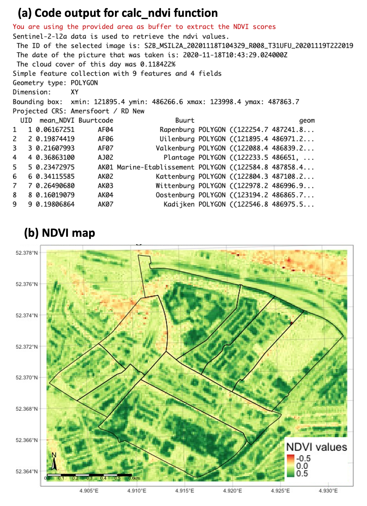
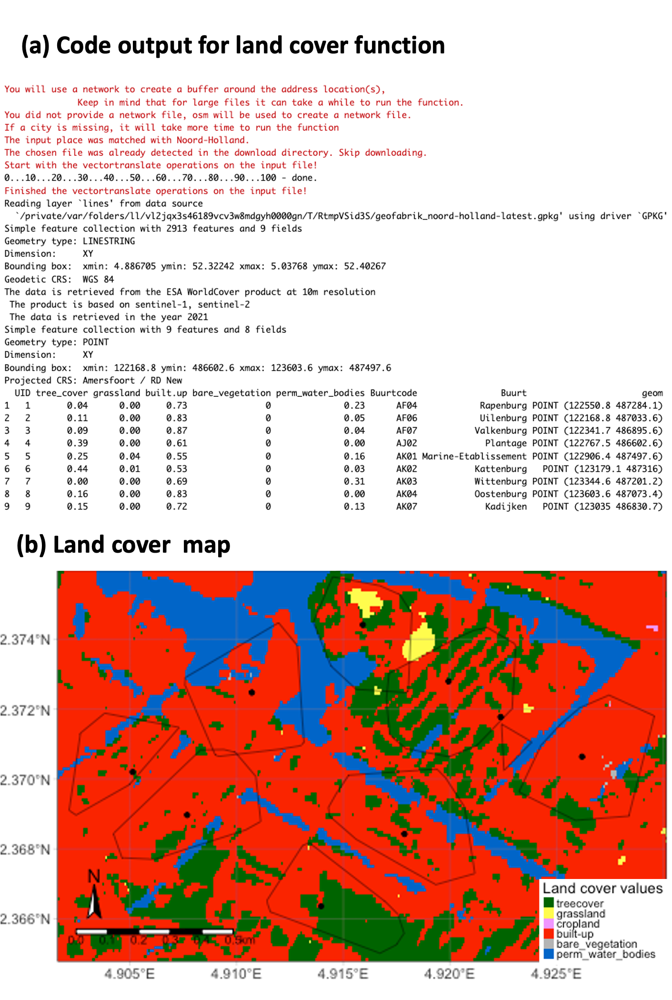
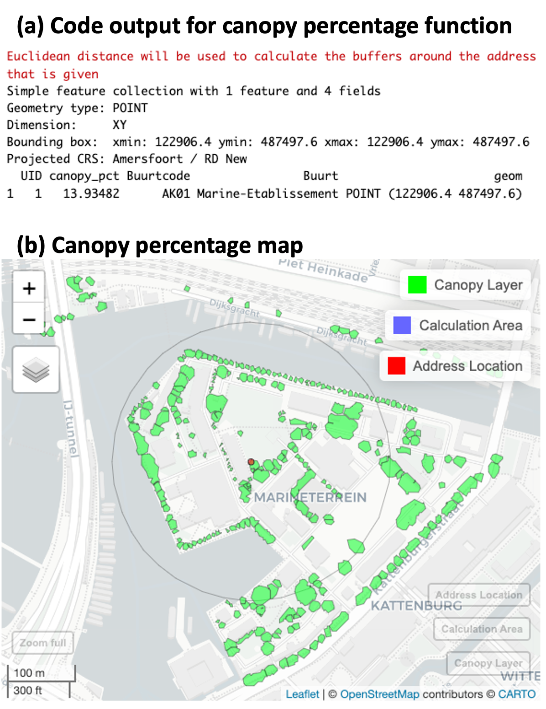
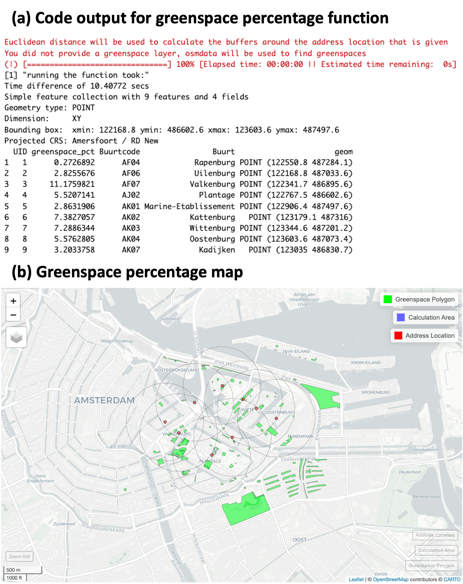
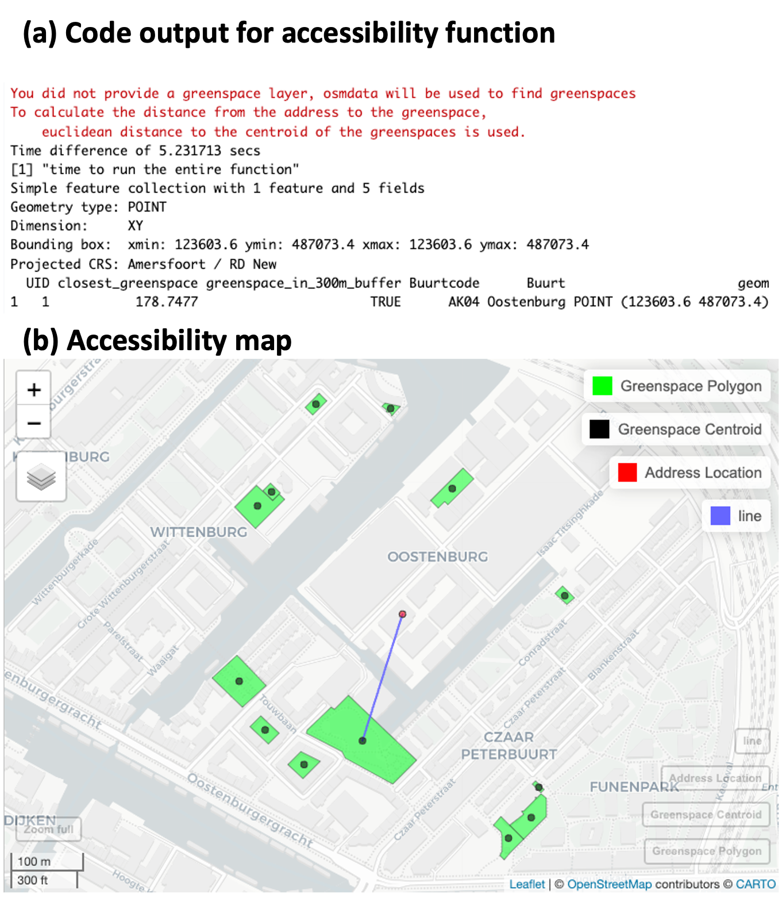
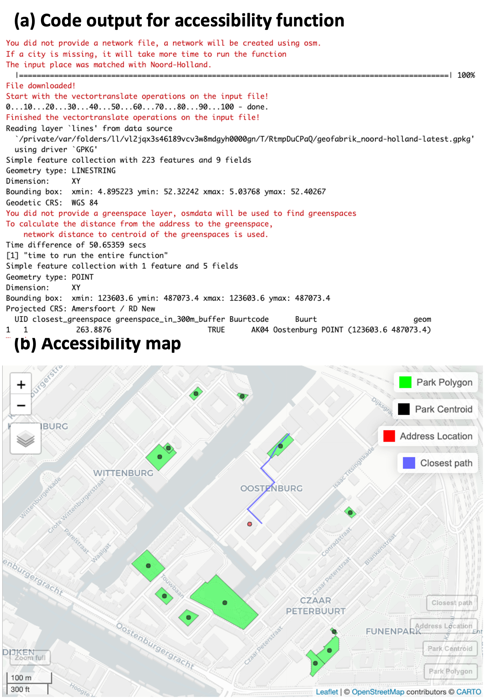
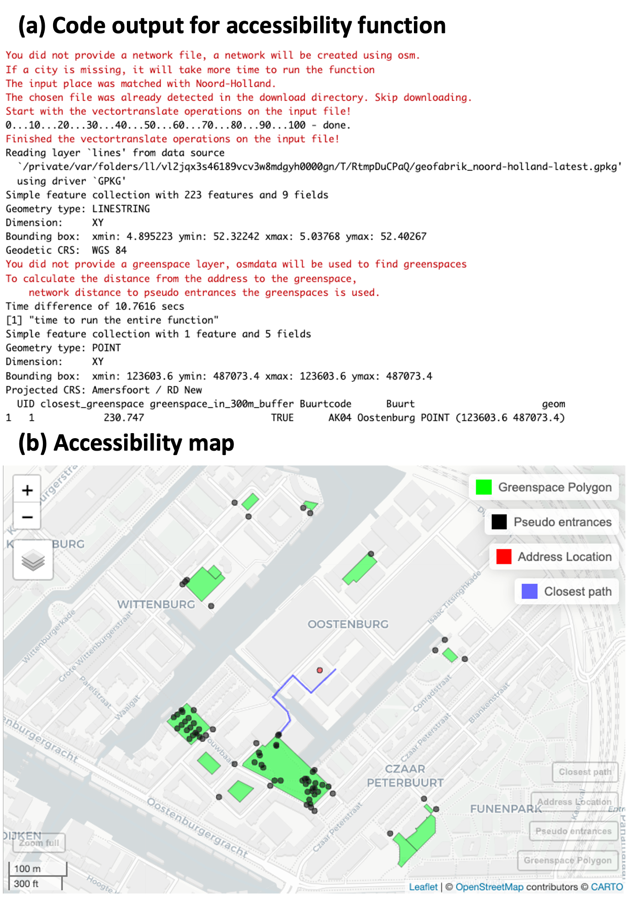
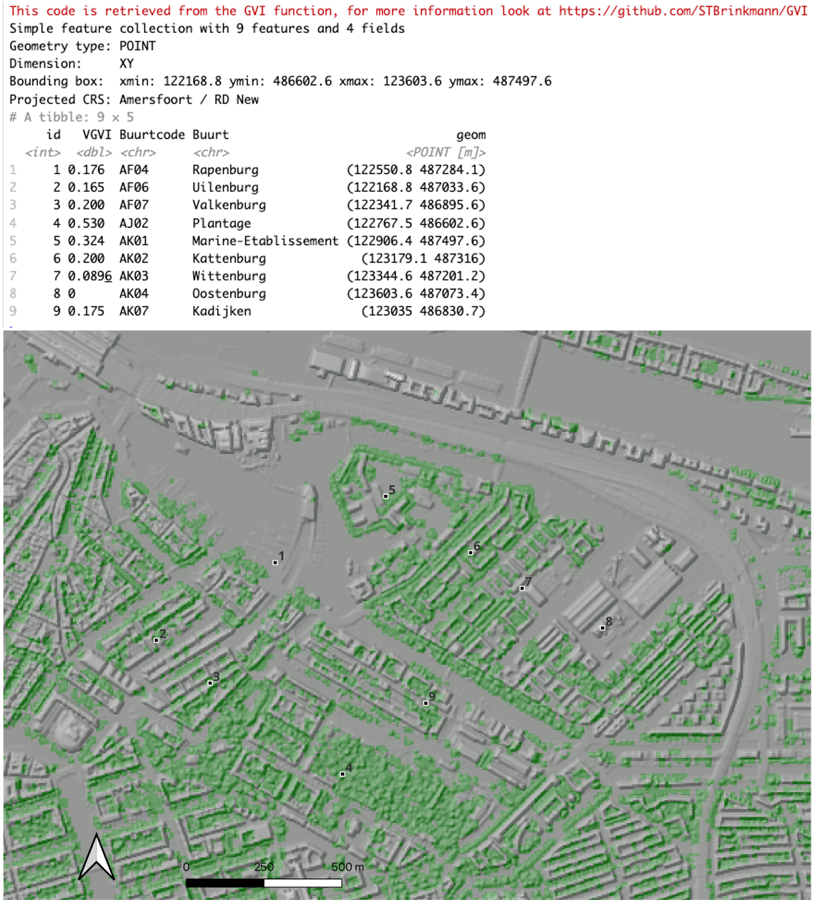
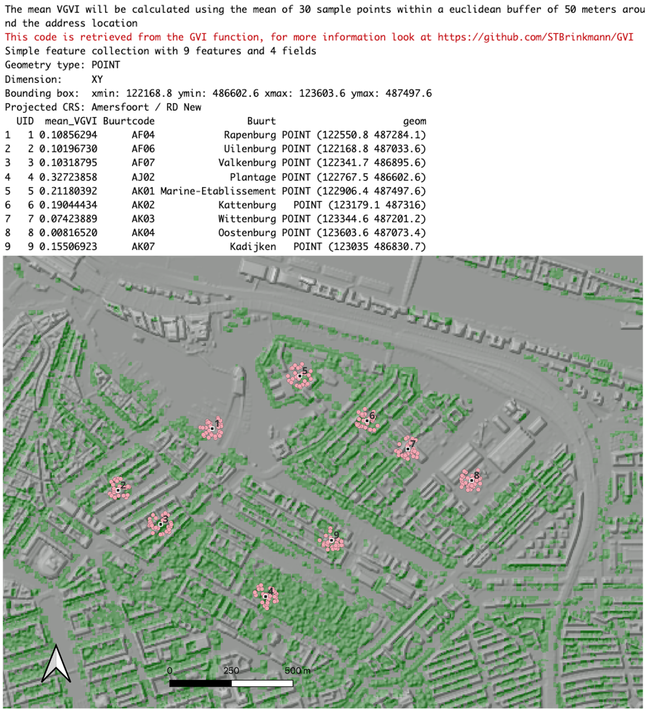

# Greenness Exposure Assessment in R 


# Aim and objectives

This package is developed to facilitate robust and transparent analysis in greenspace and vegetation in general. It provides researchers with a collection of multidimensional functionalities of greeness modeling that can be applied across multiple countries, enabling comprehensive spatial analysis and enhancing the accuracy of results.

# Table of contents

<!-- badges: start -->
<!-- badges: end -->
- [Installation](#installation)
- [Data](#data)
  * [Amsterdam Neighborhoods](#ams_neighborhoods)
  * [Amsterdam Houses](#ams_houses)
  * [Amsterdam Parks](#ams_parks)
- [Functionalities](#functionalities)
  * [Preparation](#preparation)
  * [Availability](#availability)
    + [Calc NDVI](#calc-ndvi)
    + [Land Cover](#land-cover)
    + [Canopy coverage](#canopy-coverage)
    + [Greenspace percentage](#greenspace-percentage)
  * [Accessibility](#accessibility)
    + [Greenspace access](#greenspace-access)
  * [Visibility](#visibility)
    + [Viewshed](#viewshed)
    + [vgvi from sf](#vgvi-from-sf)
    + [vgvi from address](#vgvi-from-address)
- [Extended Installation](#alternative-installation)
  * [GEE](#gee)
  * [Rcpp](#rcpp)
- [Sources](#sources)
- [Acknowledgements](#acknowledgements-and-contact)

# Installation

You can install the development version of GreenExp from [GitHub](https://github.com/) with:
For Windows installation, please install R-tools from (https://cran.r-project.org/bin/windows/Rtools/) before running the code below

``` r
# install.packages("devtools")
devtools::install_github("Spatial-Data-Science-and-GEO-AI-Lab/GreenExp_R", dependencies = TRUE)
```


---

# Data 

This package is provided with three sf datasets for example analyses:

1. [Ams_Neighborhoods](#ams_neighborhoods)
2. [Ams_Houses](#ams_houses)
3. [Ams_Parks](#ams_parks)

These datasets will be used as examples to explain the [Functionalities](#functionalities).

#### Ams_Neighborhoods

The first dataset is an sf data frame of neighborhoods in Amsterdam. This dataset is retrieved from [Gemeente Amsterdam](https://maps.amsterdam.nl/gebiedsindeling/). 

Run the following code for more information. 

```r
library(GreenExp) 
?Ams_Neighborhoods
```

---

#### Ams_Houses

The Ams_Houses contain houses that are created by taking the centroid of the aforementioned [Ams_Neighborhoods](#Ams_Neighborhoods)
Run the following code for more information. 

```r
library(GreenExp) # If GreenExp is not loaded yet
?Ams_Houses
```
---

#### Ams_Parks

The Ams_Parks dataset is also retrieved from the [Gemeente Amsterdam](https://maps.amsterdam.nl/stadsparken/)
Run the following code for more information 
```r
library(GreenExp) # If GreenExp is not loaded yet
?Ams_Parks
```


# Functionalities 

---

## Preparation

The Functionalities, which will be treated in the next subsections, will be provided with examples.
To avoid computationally heavy examples, a few neighborhoods in Amsterdam will be selected, namely: 
Rapenburg, Uilenburg, Valkenburg, Marine-Etablissement, Kadijken, Plantage, Kattenburg, Wittenburg and Oostenburg. 


```r
library(GreenExp) # If not loaded yet
library(magrittr) # If not loaded yet (used for piping %>%)


neighborhoods <- c('Rapenburg', 'Uilenburg', 'Valkenburg', 
            'Marine-Etablissement', 'Kadijken', 'Plantage', 
            'Kattenburg', 'Wittenburg', 'Oostenburg')

# Filter the neighborhoods
df <- Ams_Neighborhoods %>%
  dplyr::filter(Buurt %in% neighborhoods)

# Create point locations in Amsterdam  
df_points <- sf::st_centroid(df)

# Create the parks
df_parks <- Ams_Parks
  
```

Please note that the examples based on this data serves as an illustration, and you may need to adapt the parameters and function usage to match your specific scenario.


---

## Availability

Availability will be assessed using four functions:

1. [Calc NDVI](#calc-ndvi)
2. [Land Cover](#land-cover)
3. [Canopy coverage](#canopy-coverage)
4. [Park percentage](#park-percentage) 

Each of these functions will provide an [sf](https://r-spatial.github.io/sf/articles/sf1.html) `dataframe` that includes the input location and the specific values requested within a defined buffer.


The user has the option to input either a point geometry or a (multi)polygon geometry. By default, the address location will be transformed into a point geometry, and a buffer will be created around it to calculate the availability. However, users can choose to use the provided polygon geometry to calculate availability by setting the 'address_location_neighborhood' parameter to TRUE.

By default, the buffer around the input location is measured in Euclidean distance. However, it can be modified to utilize a network buffer. The distinction between the two types of buffers is illustrated in the figure below. In this instance, the Euclidean buffer has a fixed radius of 1000 meters, while the network buffer is calculated based on a speed of 5 km/h over 10 minutes.


The following subsections will briefly describe each availability function and examples extracted from the neighborhood polygons and points in Amsterdam. 

---

### Calc NDVI 

The `calc_ndvi` function computes the average Normalized Difference Vegetation Index [(NDVI)](https://en.wikipedia.org/wiki/Normalized_difference_vegetation_index) within a specified distance for a given location(s). The input for the function is `address_location`, which should be an `sf dataframe`. It is recommended to provide the `address location` with a projected Coordinate Reference System [(CRS)](https://docs.qgis.org/3.28/en/docs/gentle_gis_introduction/coordinate_reference_systems.html#:~:text=In%20layman%27s%20term%2C%20map%20projections,real%20places%20on%20the%20earth). If no projected CRS is provided, the address location will be automatically projected to [WGS 84 / World Mercator](https://epsg.io/3395). 


You have the option to provide a raster file containing NDVI values. However, if no raster file is provided, the function will use the [Sentinel-2-l2a](https://planetarycomputer.microsoft.com/dataset/sentinel-2-l2a) dataset from Planetary Computer as the default data source for calculating NDVI. The code snippet below shows how to calculate the NDVI for the neighborhoods.

``` r
# Calculate the NDVI for neighborhoods
GreenExp::calc_ndvi(df, address_location_neighborhood = TRUE)
```

In the Figure below, you can find the Output after running the calc_ndvi function and a plot corresponding to the results.




If desired, users are able to switch the engine to `GEE` (Google Earth Engine) for performing the calculations


---

### Land Cover


The `land_cover` function calculates the average land cover within a specified distance for given location(s). The input for the function is address_location, which should be an `sf dataframe` with projected Coordinate Reference System (CRS) information. If no CRS is provided, the function will automatically project the address location to WGS 84 / World Mercator.

You have the option to provide a raster file wiht land cover values. When this is not provided, the [esa-worldcover](https://planetarycomputer.microsoft.com/dataset/esa-worldcover) data set of Planetary Computer will be used to calculate the land cover.

In the code chunk and figure below an example is given for the Amsterdam area. It illustrates an example of land cover within a network buffer of 300m in Amsterdam. It showcases nine address locations, and the land cover is determined based on the surrounding road network obtained from the  [osmextract](https://cran.r-project.org/web/packages/osmextract/vignettes/osmextract.html) package.


``` r
GreenExp::land_cover(df_points, buffer_distance=300, network_buffer=T)
```




---

### Canopy coverage

The `canopy_perc` function calculates the percentage of a canopy within a given buffer distance or location. 
For the canopy percentage we will provide an example in Marine-Etablissement, which is a district in Amsterdam. In the code below we are calculating the canopy percentage.

``` r
# load canopy data
canopy_layer <- sf::st_read('path/to/canopy_layer.gpkg')

# Select Marine-Etablissement
df_point_canopy <- df_points[df$Buurt=='Marine-Etablissement',]]

GreenExp::canopy_pct(df_point_canopy, canopy_layer = canopy_layer, buffer_distance=200)
```



---

### Greenspace percentage

The `park_pct` function calculates the percentage of park coverage within a specified buffer distance. If you do not provide a `greenspace_layer`, the function will retrieve greenspace features from osmdata. The retrieved features are selected from categories such as leisure, nature, and land use, following the requirements outlined by Breekveldt:

In the example below, the percentage of greenspaces is calculated for each address point within a euclidean buffer of 300m. The greenspace data is obtained from the retrieved OSM data.

The `park_pct` function gives the percentage of park coverage given a certain buffer. If the `greenspace_layer` is not given, the greenspaces will be retrieved using features from [osmdata](https://wiki.openstreetmap.org/wiki/Map_features). The features which are retrieved from OSM are found within the leisure, nature and land use categories. In line with the work of [Breekveldt](https://github.com/Spatial-Data-Science-and-GEO-AI-Lab/Urban_Greenspace_Accessibility), the features need to adhere to the following requirements; 

1. The feature represents an area.
2. The area is outdoors.
3. The area is (semi-)publicly available.
4. The area is likely to contain trees, grass, and/or greenery.
5. The area can reasonably be used for walking or recreational activities.

Based on these criteria, the following features from OSM are used:

- Allotments
- Forest
- Greenfield
- Village green
- Garden
- Fitness station
- Nature reserve
- Playground
- Grassland

In the example below, the percentage of greenspaces is calculated for each address point within a euclidean buffer of 300m. The greenspace is based on the retrieved data from OSM. 

``` r
GreenExp::greenspace_pct(df_points, buffer_distance=300)
```




---

## Accessibility

### Greenspace access


The greenspace_access function provide the ability to determine the nearest greenspaces to given address locations and assess their accessibility within a specified buffer distance. By default, the functions utilize a euclidean buffer around the address locations and calculate the shortest distance to the centroid of the greenspaces. This is achieved using the K-nearest neighbors (KNN) algorithm with the [FNN](https://rdrr.io/cran/FNN/man/knn.html) package, to calculate the euclidean distance between the address location and the greenspaces.


Furthermore, the functions allow for the option to utilize a network buffer instead of the euclidean buffer. In this case, the distance calculation is performed using the [sfnetworks](https://cran.r-project.org/web/packages/sfnetworks/index.html) package, which leverages road networks to calculate distances between points.

Additionally, pseudo entry points can be employed to calculate the distance to the greenspaces. These pseudo entrances are created by generating a 10-meter buffer around the greenspace polygons and intersecting them with the network nodes obtained from the intersection of the network points with the greenspaces.


Three examples will be provided. For the sake of visualization, one address point will be used to calculate the accessibility. 

**Example 1: Euclidean Distance Calculation**

In this example, the accessibility function is applied using the default settings, which involves calculating the euclidean distance from the address location to the nearest greenspace centroid. The figure below illustrates an example in Amsterdam, where the parks are represented by green polygons. The blue lines indicate the euclidean distance from the address location to the nearest park centroid. The park centroids are depicted as black points, while the address location is denoted by a red point. The code chunk beneath the plot provides the necessary code to receive the shortest distance from the address location. 

``` r
df_point_access <- df_points[df$Buurt==’Oostenburg’, ]

GreenExp::greenspace_access(df_point_access, buffer_distance = 300)
```



--- 

**Example 2: Network Distance Calculation**

In this example, the accessibility function utilizes network distance to compute the distance from the address location to the nearest greenspace centroid. The figure below showcases an example in Amsterdam, where the parks are represented by green polygons. However, since the lines are retrieved from an OSM network file, the park centroids and address centroid may not align exactly with the network lines. As a result, you may notice that the lines do not intersect with the points in the plot. The park centroids are depicted as black points. The code chunk below the plot corresponds with the distance result of the plot


``` r
GreenExp::greenspace_access(df_point_access, buffer_distance = 300, euclidean=F)
```



---

**Example 3: Network Distance to Pseudo Entrances**

In this example, the accessibility function considers network distance to the pseudo entrances of the greenspaces. The pseudo entrances are created by buffering the greenspace polygons and intersecting them with the network nodes. The function calculates the network distance from the address location to the nearest pseudo entrance point. The figure below presents an example in Amsterdam, where the parks are shown as green polygons. The blue lines indicate the euclidean distance from the address location to the nearest park centroid. The park centroids are depicted as black points, and the address location is represented by a red point. Additionally, you may observe multiple pseudo entrances within the parks, as roads passing through the parks can also serve as potential entrance points. 

```r
GreenExp::greenspace_access(df_point_access, buffer_distance=300,
                            euclidean = F, pseudo_entrance = T)

# Simple feature collection with 1 feature and 3 fields
# Geometry type: POINT
# Dimension:     XY
# Bounding box:  xmin: 123603.6 ymin: 487073.4 xmax: 123603.6 ymax: 487073.4
# Projected CRS: Amersfoort / RD New
#   UID closest_greenspace greenspace_in_300m_buffer                  geometry
# 1   1            230.747                      TRUE POINT (123603.6 487073.4)
```




## Visibility
 
The visibility functions are made by the [GVI](https://github.com/STBrinkmann/GVI) package with some adaptations. 

---

### Viewshed

The viewshed function computes a binary viewshed of a single point on a Digital Surface Model (DSM) raster. A radial buffer is applied on the observer position, and visibility is being calculated usig a C++ implementation of Bresenham’s line algorithm [Bresenham 1965](https://ieeexplore.ieee.org/document/5388473) & [Bresenham 1977](https://doi.org/10.1145/359423.359432) and simple geometry. The
result of the `viewshed` function is a radial raster where 0 =
no-visible and 1 = visible area.

For a better explanation, go to the [GVI](https://github.com/STBrinkmann/GVI) package.


```r
# Read in the digital eleveation model
GS <- terra::rast('data/GS_AMS.tif')
# Read the digital surfaca model
DSM <- terra::rast('data/DSM_AMS.tif')
# Read the greenspace 
DTM<- terra::rast('data/DTM_AMS.tif')

GreenExp::viewshed(observer = df_points[1,], dsm_rast = DSM, dtm_rast = DTM,
                         max_distance = 200, observer_height = 1.7, plot = TRUE)

```


The left plot represents the Digital Elevation Model (DEM), whereas the right plot represents the viewshed, where green is the visible area and gray is not visible. 

### vgvi from sf

The Viewshed Greenness Visibility Index (VGVI) represents the proportion of visible greenness to the total visible area based on the `viewshed`. The estimated VGVI values range between 0 and 1, where = no green cells and 1= all of the visible cells are green.

Based on a viewshed and a binary greenspace raster, all visible points are classified as visible green and visible no-green. All values are summarised using a decay function, to account for the reducing visual prominence of an object in space with increasing distance from the observer. Currently two options are supported, a logistic and an exponential function.

For more information about the VGVI please go to the [GVI](https://github.com/STBrinkmann/GVI) package. For more information about the algorithms look at the paper by [Brinkmann, 2022](https://doi.org/10.5194/agile-giss-3-27-2022) and [Labib et al., 2021](https://doi.org/10.1016/j.scitotenv.2020.143050)

**Example:**

The figure below provides an overview of the data used for calculating the VGVI. In the figure, you will find various elements that contribute to the analysis.

1. Observer Points: The dots depicted in the figure represent the observer points. These points correspond to the addresses used in the examples discussed thus far. Each observer point serves as a starting location for measuring the VGVI.

2. Address ID Numbers: The numbers assigned to the addresses in the plot correspond to the ID numbers used in the code chunk below the figure. These ID numbers uniquely identify each address and allow for easy referencing and analysis in the code.

3. Green Space: The green shades in the plot represent the tree raster, which represents the extent of green space. It indicates the areas covered by vegetation, such as trees or parks, and is a crucial factor in determining the VGVI.  

4. DEM and DSM: The figure also includes the Digital Elevation Model (DEM) and Digital Surface Model (DSM). These models provide information about the elevation of the terrain and structures present in the area. The combination of DEM and DSM helps in understanding the topography of the region.

By utilizing this information and the corresponding code, the VGVI can be calculated, providing insights into the vegetation-ground view characteristics at each observer point.



```r
VGVI <- GreenExp::vgvi_from_sf(observer = df_points,
             dsm_rast = DSM, dtm_rast = DEM, greenspace_rast = GS,
             max_distance = 200, observer_height = 1.7,
             m = 0.5, b = 8, mode = "logit")
```


--- 


### VGVI from address

GVI from address function: In contrast, the VGVI from address function employs a broader approach. It samples multiple points around the address location within a defined buffer. This buffer represents a circular area around the address. The function collects data from various points within this buffer and calculates the VGVI by taking the mean of the collected values. By incorporating multiple sample points, it offers a more comprehensive representation of the VGVI within the vicinity of the address.

The VGVI from sf function analyzes the VGVI at a specific observer point, while the VGVI from address function expands the analysis by sampling multiple points around the address location. The latter approach captures the GVI within a defined buffer and provides a more averaged assessment of the VGVI.


```r
VGVI <- GreenExp::vgvi_from_address(address = df_points,
             dsm_rast = DSM, dtm_rast = DEM, greenspace_rast = GS,
             max_distance = 200, observer_height = 1.7,
             m = 0.5, b = 8, mode = "logit")

```



---

# Extended installation

To make optimal use of the package 

## GEE 

This step is optional, by default the [Planetary Computer](https://planetarycomputer.microsoft.com) will be used for satellite images, 
But if you also want to use the [Google Earth Engine](https://earthengine.google.com), and do not have it installed yet,
you need to follow the following steps or the steps given in this [instruction video](https://www.youtube.com/watch?v=_fDhRL_LBdQ)

**Step 1:**

Make an account on  [Google Earth Engine](https://earthengine.google.com)


``` r
install.packages(c("sf", "reticulate", "remotes"))
```
afterwards install the [rgee](https://github.com/r-spatial/rgee) package from github

``` r
# Install the rgee package from the r spatial GitHub
remotes::install_github("r-spatial/rgee")

# load the reticulate and rgee package
library(reticulate)
library(rgee)
```

**Step 2:**

Running `reticulate::py_discover_config()` will install `Miniconda`

``` r
# Use the py_discover_config() function to see what version of Python will be used
# without actually loading pythong
reticulate::py_discover_config()

# python:         /Users/martijn/.virtualenvs/rgee/bin/python
# libpython:      /Users/martijn/anaconda3/lib/libpython3.10.dylib
# pythonhome:     /Users/martijn/.virtualenvs/rgee:/Users/martijn/.virtualenvs/rgee
# version:        3.10.9 (main, Mar  1 2023, 12:20:14) [Clang 14.0.6 ]
# numpy:          /Users/martijn/.virtualenvs/rgee/lib/python3.10/site-packages/numpy
# numpy_version:  1.24.3

# Verify the current Python path
import('sys')$executable
# [1] "/Users/martijn/.virtualenvs/rgee/bin/python"


# Create an isolated Python venv with all rgee dependencies
ee_install()
# look at the path to the rgee env
```

**Step 3:**

After this bit, please restart your pc/laptop and launch R again. 

**Step 4:**

Initializing

``` r
# Set python version to use
reticulate::use_python("/Users/martijn/.virtualenvs/rgee/bin/python")
reticulate::py_config()

library(rgee)

#Initialize the Earth Engine
ee_Initialize()

## 2. Install geemap in the same Python ENV that use rgee
py_install("geemap")
gm <- import("geemap")

```

Enter the email you used to sign-up for GEE 

copy the code into R 

── rgee 1.1.6.9999 ───────────────────────────────────── earthengine-api 0.1.354 ── 

 ✔ user: not_defined 
 
 ✔ Initializing Google Earth Engine:  DONE!
 
 ✔ Earth Engine account: users/ee-greenexp 
 
---

## Rcpp 

Make sure the [Rcpp package](https://cran.r-project.org/web/packages/Rcpp/index.html) is installed.
If you are using mac, make sure you have [Xcode](https://apps.apple.com/nl/app/xcode/id497799835?mt=12) installed. 

Furthermore you have to make a Makevars file if the cpp files are not working. 
go to terminal and do the following:

```
mkdir .R
cd .R 
touch Makevars
open Makevars

## copy and paste:
FC = /opt/homebrew/Cellar/gcc/13.1.0/bin/gfortran
F77 = /opt/homebrew/Cellar/gcc/13.1.0/bin/gfortran
FLIBS = -L/opt/homebrew/Cellar/gcc/13.1.0/lib/gcc/13
```
---


## Sources 

| Package       | Description                                                           |                                
|---------------|-----------------------------------------------------------------------|
| [**sf**](https://github.com/r-spatial/sf)| Simple features for R                                                 | 
| [**terra**](https://cran.r-project.org/package=terra)| Creating, reading, manipulating, and writing raster data              |
| [**sfnetworks**](https://cran.r-project.org/package=sfnetworks)| Tidy Geospatial Networks in R                                         | 
| [**osmdata**](https://cran.r-project.org/package=osmdata)|Provides access to the vector data underlying OSM                     | 
| [**osmextract**](https://cran.r-project.org/package=osmextract)| Download and import Open Street Map Data Extracts| 
| [**dplyr**](https://cran.r-project.org/package=dplyr)    | Data manipulation                                                     |
| [**magrittr**](https://cran.r-project.org/package=magrittr)| Forward-Pipe Operator                                                 | 
| [**rgee**](https://cran.r-project.org/package=rgee)| Calling Google Earth Engine API                                       | 
| [**rstac**](https://cran.r-project.org/package=rstac)|      Search and download spacetime earth observation data via STAC         |
| [**FNN**](https://cran.r-project.org/package=FNN)   | Fast Nearest Neighbor Search Algorithms                               | 
| [**tidygraph**](https://cran.r-project.org/package=tidygraph) | A tidy API for graph/network manipulation                            | 
| [**tidyr**](https://cran.r-project.org/package=tidyr)    | Changing the shape and hierarchy of a dataset                        | 
| [**Rcpp**](https://cran.r-project.org/package=Rcpp)     | R and C++ integration                                                 | 
| [**progress**](https://cran.r-project.org/package=progress)  | Make a progress bar in loops                                          | 
| [**GVI**](https://doi.org/10.1016/j.scitotenv.2020.143050)  | information about the calculation of the visiblity                                         | 


## Acknowledgements and contact

Project made in collaboration with Dr. SM Labib from the Department of Human Geography and Spatial Planning at Utrecht University. This is a project of the Spatial Data Science and Geo-AI Lab, conducted for the Applied Data Science MSc degree.

| Name        | Email                       |
|-------------|-----------------------------|
| [Martijn Koster](https://github.com/MartijnKoster1)  | m.koster2@students.uu.nl |
| S.M. Labib  | s.m.labib@uu.nl             |

